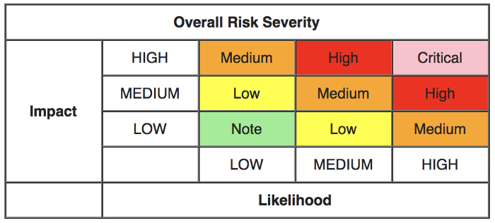

# Bug Bounty Program

### **Program Overview**

The Furucombo team has been seeking to combine the merits of every kind of DeFi protocol to create the most comprehensive DeFi aggregator platform on Ethereum. The structure of Furucombo is composed of Proxy Contract and Handler Contracts. The security of our system is of paramount importance to us. While we keep conducting professional audits for the whole system, a bug bounty program is necessary to further ensure the platform’s safety.

This program is intended to work with independent security researchers across the globe and set out our definition of good faith in the context of finding and reporting vulnerabilities, as well as what users can expect from us in return. Should you encounter a security vulnerability in one of our products, we want to hear from you. We believe that the Furucombo ecosystem will be further bolstered with support from our community.

### **Scope**

The scope of the bug bounty will be applicable for the following repositories and sites:

* [https://furucombo.app/](https://furucombo.app/)
* [https://github.com/dinngodev/furucombo-contract](https://github.com/dinngodev/furucombo-contract)

Note: Other issues found outside of the locations mentioned above, will be considered on a case by case basis, please, reach out to the Furucombo development team for clarification.

### **Rewards**

The value of rewards will vary depending on severity as judged by the Furucombo team. The severity of a bug will be assessed according to [the OWASP risk rating model](https://owasp.org/www-community/OWASP_Risk_Rating_Methodology#:~:text=Discovering%20vulnerabilities%20is%20important%2C%20but,business%20is%20just%20as%20important.&text=This%20system%20will%20help%20to,that%20are%20less%20well%20understood.) based on Impact and Likelihood:

* Note: Up to $100 USD
* Low: $100 — $1,000 USD
* Medium: $1,000 — $5,000 USD
* High: $5,000 — $20,000 USD
* Critical: $20,000 — $250,000 USD

Furucombo team determines the eligibility of vulnerability, scores, and whether a reward is granted at its sole and own discretion. The payouts will be denominated in USD and be paid in COMBO tokens.

### **Disclosure**

Any vulnerability or bug discovered must be reported **only** to the following email: **security@dinngo.co**

* Please do not disclose any vulnerability or bug to the public or to any person.
* Please limit each submission to one issue.
* Please provide sufficient detail in your disclosure, including a description of the bug, its potential impact, and steps for reproducing it or proof of concept, to enable the Furucombo team to quickly understand, reproduce, and address the vulnerability promptly.

A detailed report of a vulnerability increases the likelihood of a reward and may increase the reward amount.

### **Rules for the Bounty**

* Identify an original, previously unreported, non-public vulnerability within the scope of the Furucombo bug bounty program.
* Provide sufficient information to reproduce the problem to enable the Furucombo team to address the issue.
* Do not exploit the vulnerability in any way, including through making it public or by obtaining a profit.
* Duplicated issues are not eligible for reward. The first submission would be the eligible one.
* Avoid privacy violations, destruction of data, interruption, degradation, or any malicious attack on Furucombo.


_Breaking or neglecting any of the rules mentioned above will be a violation of the Furucombo Bug Bounty Program. Furucombo reserves the right to modify or cancel the program at Furucombo’s sole discretion and at any time._


