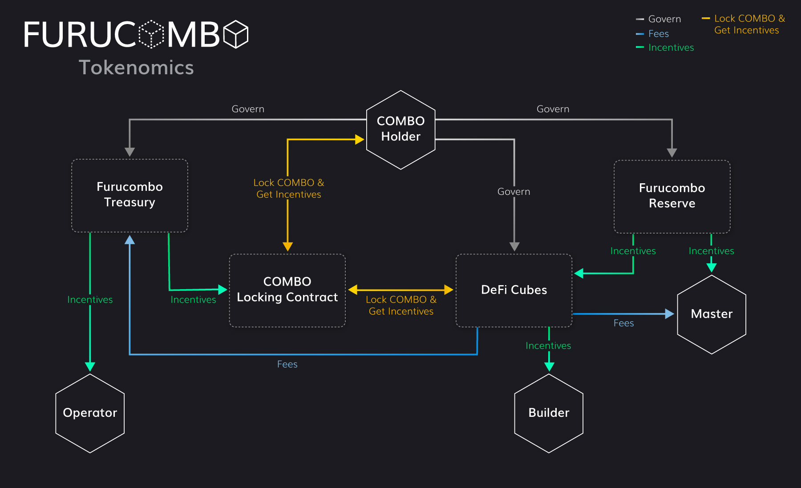

# Furucombo Tokenomics

> One thing that we would all agree on about the DeFi space is: _there are too many things going on and too little time to DYOR!_

As the DeFi space continues to change at pace, users feel overwhelmed by the number of new DeFi products and the complexity of assessing them. Masters are good at profit-making, but the return is limited by the capital one can allocate. Builders are frustrated because it becomes more difficult to stand out in a sea of legos and increasingly difficult or costly to carry out composability with other protocols.

As a result, Furucombo has tapped into DeFi as an aggregator to help users navigate through the vast amount of protocols - to let masters focus on profit-maximizing, and to give builders a platform to bring out the potential of their product to the fullest. 

That's why we are here:

> Furucombo will form a value ecosystem as a super-aggregator to bring builders and masters onboard.

And, COMBO is the key to making that happen. 

The above diagram describes the goal to create a flexible, secure, and sustainable network of ecosystems regulated by cube-specific policies that are defined and validated through a governance process that empowers token holders with the right to decide the path forward.

