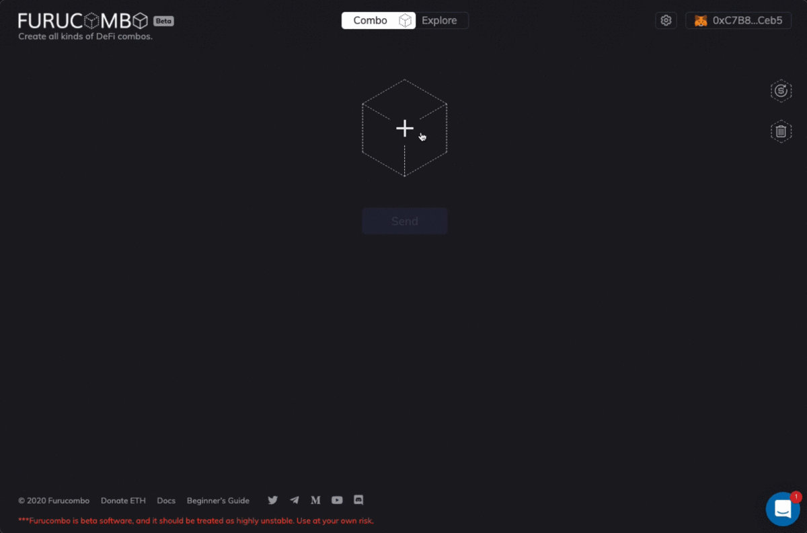

# COMBO FAQ

#### **What’s COMBO?** 

* To become a completely self-sustainable ecosystem, Furucombo v2, COMBO Token would be the key piece of the puzzle to make it happen. → [Introducing COMBO Token](%20https://go.furucombo.app/26zZv%20)
* COMBO token Address: [`0xffffffff2ba8f66d4e51811c5190992176930278`](https://etherscan.io/token/0xfFffFffF2ba8F66D4e51811C5190992176930278)\`\`

#### **COMBO Utility?**

* Current utility
  * [COMBO Farming](https://docs.furucombo.app/other-faq/combo-mining-season-3)
  * [PieDAO Index](https://snapshot.org/#/piedao/proposal/QmSedazVqdvqRf2rB6AJ8mMituh5XjgM36zJTE21MdqFgw)
  * [CEX & DEX Trading](https://www.coingecko.com/en/coins/furucombo#markets)
* Coming soon
  * Participate in governance.
  * Enjoy premium features.
  * Be incentivized to share fees collected on Furucombo.

#### **How to get COMBO?**

* Join [the COMBO mining season 3 program](https://go.furucombo.app/3u2fT)
* Join Furucombo ongoing campaigns.

#### How to stake COMBO token**?**

