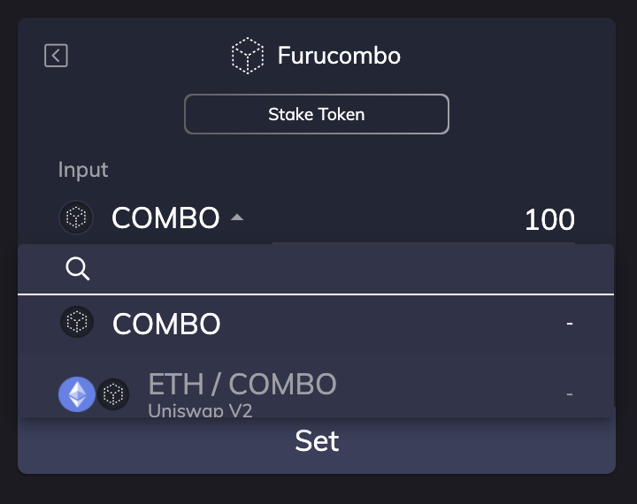

# COMBO veelgestelde vragen

#### Wat is COMBO? 

* Om een volledig zelfvoorzienend ecosysteem te worden, zou Furucombo v2, COMBO Token het belangrijkste stukje van de puzzel zijn om het te laten gebeuren. → Details [https://go.furucombo.app/26zZv](https://go.furucombo.app/26zZv) 
* COMBO-tokenadres: [`0xffffffff2ba8f66d4e51811c5190992176930278`](https://etherscan.io/token/0xfFffFffF2ba8F66D4e51811C5190992176930278)\`\`

#### **COMBO-hulpprogramma?**

* beheer van het platform,
* geniet van premiumfuncties, en
* deelkosten geïnd op Furucombo!

#### **Hoe kom je aan COMBO?**

* Doe NU mee met COMBO Mining Season 3-programma → Detail [https://go.furucombo.app/3u2fT](https://go.furucombo.app/3u2fT)
* Doe mee met Furucombo's lopende campagnes.

#### Hoe COMBO-token in het zwembad te storten?

> 🧊 Special thanks to [blackcatx](https://twitter.com/gaintodayx) for translating this page.

