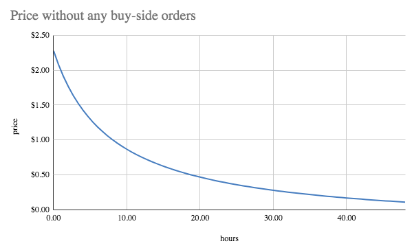

# COMBO launch on Balancer LBP \(ended\)

## The Initial COMBO Launch

Furucombo will distribute 4,000,000 COMBO Tokens via a Balancer Liquidity Bootstrapping Pool \(LBP\) on [Jan 12, 2021 at about 15:00 UTC](https://savvytime.com/converter/utc-to-taiwan-taipei-ca-san-francisco-ny-new-york-city-united-kingdom-london/jan-12-2021/3pm). The LBP will last for 48 hours only, ending on Jan 14, 2021, at around 14:59 UTC.


**Token Launch Details**

* When: COMBO:USDC pool opens at [15:00 UTC on Jan 12, 2021, for 48 hours](https://savvytime.com/converter/utc-to-taiwan-taipei-ca-san-francisco-ny-new-york-city-united-kingdom-london/jan-12-2021/3pm).
* Where: [Balancer’s LBP](https://balancer.exchange/#/swap/0xA0b86991c6218b36c1d19D4a2e9Eb0cE3606eB48/0xfFffFffF2ba8F66D4e51811C5190992176930278%20) \([COMBO LBP INFO](https://pools.balancer.exchange/#/pool/0xc99317ceef9ed2ab9ff0ec99f64f3dd61b09a6b2/)\)
* How: The Balancer LBP will be live for 48 hours. This will be the ONLY place where you can get COMBO tokens directly from the team.
* Amount: 4% of total COMBO supply is allocated for this launch.
* Weight: COMBO:USDC pool weight will start at 90:10 and decline to 30:70 over ~48 hours.


The reason we select Balancer LBP to do the launch instead of other regular AMM pools is that we wish to have a smooth price discovery process without speculators/frontrunners doing pump and dump.

The magic of Balancer LBP to achieve that mission is that the weight of the LBP pool would change over time, from COMBO/USDC 90/10 to 30/70 over 48 hours, and the result of the change is that the COMBO price will automatically decrease when nobody is either buying or selling it. Refer to the below image, it's a stimulation for a scenario that no buy or sell orders at all during the 48 hours. So you can see that there's no incentives for the speculators to rush in to buy, and the buyers would standby to wait for a few more hours to participate.

On the other hand, because the price would decrease by nature of the LBP design, we would set the COMBO price at a higher place to provide some room for the decrease. Hence, we want to remind you that **please do not swap COMBO tokens too early or you may get rekt, and it's typical that the COMBO price will decline in the beginning.**

## How to participate in COMBO Token’s LBP

To get some COMBO token on Balancer LBP, you just need to go through three steps.

* Step 1: Navigate to Balancer LBP via Furucombo
* Step 2: Use a wallet supported on Balancer
* Step 3: Swap your preferred token for COMBO

### Step 1: Navigate to Balancer LBP via Furucombo

Go to [Furucombo](https://furucombo.app/)’s homepage and you will see a live price chart to help you to know the current COMBO price trend immediately. It’s not live yet, but you will see a “Buy/Sell COMBO” button to lead you to the [Balancer LBP page](https://balancer.exchange/#/swap/0xA0b86991c6218b36c1d19D4a2e9Eb0cE3606eB48/0xfFffFffF2ba8F66D4e51811C5190992176930278).

Once you arrive at Balancer, you should see a page similar to the one below.

### Step 2: Use a wallet supported on Balancer

Currently, Balancer supports the following five wallets.

We recommend using [MetaMask](https://chrome.google.com/webstore/detail/metamask/nkbihfbeogaeaoehlefnkodbefgpgknn), which is a Web3 enabled cryptocurrency wallet. You can download the MetaMask extension directly in browsers such as Google Chrome, Firefox. This guide will use Metamask as an example.

Once you setup Metamask, make sure that

* You have some ETH in your wallet to pay gas fees
* Prepare USDC to exchange for COMBO tokens.

While other tokens can also be used, we recommend preparing USDC. Balancer’s multi-pool routing means other tokens besides USDC can be used, but may result in a higher price as extra hops will be required.

### Step 3: Swap your preferred token for COMBO

If this is the first time you swap USDC or the selected token on Balancer, then you need to approve Balancer first to enable the interaction with Balancer smart contracts. To do so, click the “Unlock” button to submit the transaction and wait for it to confirm. Please remember to prepare a small amount of ETH in your wallet as the gas fee.

Once you unlock your wallet, the button will then change to “Swap”. Then you can proceed to click the “Swap” button to trade your preferred tokens for some COMBO. Once you have submitted your bids, all you have to do is wait until MetaMask updates the transaction status from “PENDING” to “SUCCESS” in a few minutes. Once the status changes to “SUCCESS”, you should have received COMBO tokens!


📮 COMBO Token Address:  
[0xfFffFffF2ba8F66D4e51811C5190992176930278](https://etherscan.io/token/0xfFffFffF2ba8F66D4e51811C5190992176930278)  
🏊‍♂️ COMBO LBP Address:  
[0xc99317ceef9ed2ab9ff0ec99f64f3dd61b09a6b2](https://etherscan.io/address/0xc99317ceef9ed2ab9ff0ec99f64f3dd61b09a6b2)  
⚠️ We only have an LBP on Balancer, there is no Uniswap pool created by us.


