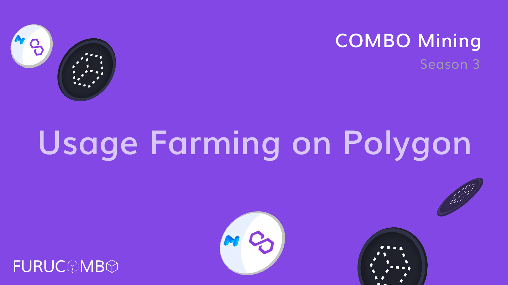

# COMBO Mining Season 3 — Usage Farming on Polygon \(ended\)

We are excited to announce Usage Farming for Furucombo on Polygon!

Usage Farming is the most important element of [the COMBO mining season 3](https://docs.furucombo.app/other-faq/combo-mining-season-3) as it aims to encourage people to try the magic of Furucombo. On Ethereum, Usage Farming is more about gas reimbursement. While on Polygon, we want to incentivize our loyal users, those who stick with Furucombo, for all types of transactions — rather than going back to the original protocol.

Thanks to the support from the Polygon team, a user can earn up to 10 MATIC & 20 COMBO per week with this Usage Farming program on Polygon!

## COMBO Mining SZN3 Bonus Event

### Update on July 7

To make sure the program is able to truly reward those who engage in using Furucombo on Polygon \(rather than washing trading\), we had a proposal voting [on our Discord](https://discord.gg/Qd4qsq5NUE) to adjust a couple of new adjustments. After a week of discussion, the final voting result is out.

**The result is positive! Hence we’ll adjust the following two items from July 8 2021, 3 AM \(UTC\).**

**`[Adjustment 1] An eligible address`**  
a. The wallet address used to join the farming program on Polygon has an amount larger than 0 ETH on Ethereum on June 24, 3 AM \(UTC\).  
b. The wallet address that has sent over 100 USDC \(or other whitelisted tokens\) from Ethereum to Polygon with the "Token Bridge" cube on Furucombo will be eligible.   
**\(An address needs to fit both rules to become an eligible address for the program\).**

**`[Adjustment 2] Double weekly reward incentives`**  
a. Even though Adjustment 1 will make the entry barrier higher than the original program design, we double the weekly rewards up to "20 MATIC + 40 COMBO per address". We believe these changes can ultimately benefit users who are genuinely trading on Furucombo.

### Program period

Jun 24 2021, 3:00 AM \(UTC\) — Aug 5 2021, 3:00 AM \(UTC\)

### How to participate

#### Step 1 — Become an eligible address:

* Any address that has sent over 100 USDC \(or other whitelisted tokens\) from Ethereum to Polygon with the ‘Token Bridge’ cube on Furucombo will be eligible.
* The wallet address used to join the farming program on Polygon has an amount larger than 0 ETH on Ethereum on June 24, 3 AM \(UTC\).
* Whitelisted Tokens & Amount List - 100 USDC, 100 USDT, 100 DAI - 150 COMBO, 65 MATIC, 0.04 ETH, 0.003 WBTC - 0.3 AAVE, 10 SUSHI, 40 CRV, 10 SNX, 4 LINK
* This is to prevent dummy addresses as the gas fee is extremely low on Polygon.

#### **Step 2 — Use any cubes of Furucombo on Polygon, for example:**

* **Aave:** Deposit, Withdraw, Borrow, Repay, Flashloan
* **Quickswap:** Swap, Add Liquidity, Remove Liquidity
* **Sushiswap:** Swap, Add Liquidity, Remove Liquidity
* **Curve:** Swap, Add Liquidity, Remove Liquidity
* **Utility:** Wrap MATIC to WMATIC, Unwrap WMATIC to MATIC

#### **Step 3 — What rewards can be earned:**

* The more you use the cubes on Polygon Furucombo, and the less you use the same feature on Polygon, the more rewards you will be eligible to receive from this Polygon-only Usage Farming program.
* **Rewards** - Rewards = Loyalty Point \* \(2 MATIC + 4 COMBO\) per week - Up to 20 MATIC + 40 COMBO per week
* **Loyalty Points** - Up to 10 points - Loyal Tx Count \* NFT Effect
* **Loyal Tx Count** - Up to 5, renews each week - Furucombo Tx Count ⁃ Furucombo Tx Count \* Non-Furucombo Tx Count / All Tx Count
* **NFT Effect** - Up to 2 times - We have sent out 30 Furucombo x Polygon Pizza NFTs, if you have one of them, you can boost the Usage Farming reward by 1.2x
* **Cap** - 7,000 MATIC and 14,000 COMBO per week - Rewards will be scaled down pro-rata if the weekly cap is reached

#### **Example:**

* For a wallet address with 4 transactions in a farming week as shown below, it can get 1.5 MATIC + 3 COMBO for the week
* Details for the wallet: - Has sent over $100 USDC from Ethereum to Polygon with the ‘Token Bridge’ cube on Furucombo previously - 1 transaction sent from Furucombo, which used the Aave deposit cube in the past week - 1 transaction sent from Aave original site to deposit to Aave in the past week - 2 token approvals transactions in the past week - No Furucombo x Polygon Pizza NFT
* Reward Calculation - Loyal Tx Count = 1–1 \* ¼ = 0.75 for the week \*Furucombo Tx Count = 1 \(as 1 Aave transaction sent from Furucombo\) \*Non-Furucombo Tx Count = 1 \(as 1 Aave transaction sent from Aave original site\) \*ALL Tx Count = 4 - Rewards = 0.75 \* \(2 MATIC + 4 COMBO\) = 1.5 MATIC + 3 COMBO for the week

### Distribution process

* We will distribute MATIC and COMBO token rewards on a weekly basis.
* The Furucombo team will calculate these rewards every Thursday \(around 4am UTC\) and share the result in our \#txmining Discord channel for community review.
* If no disputes are raised within 24hrs, the reward will then be updated to the Furucombo contract. You can then claim your rewards through the “Usage Rewards’’ cube on Polygon network.

Things to Note:

* This is the third round of the Furucombo mining program in a series. Any future rounds may have different rules and rewards.
* Using wallets such as Argent and DappLogic will not be counted because the behaviour of these wallets is quite unique.
* Failed transactions are excluded.
* Furucombo reserves the right to add new rules to exclude suspicious addresses to protect all participants.
* Furucombo is beta software, and it should be treated as highly unstable. Please use it at your own risk.

