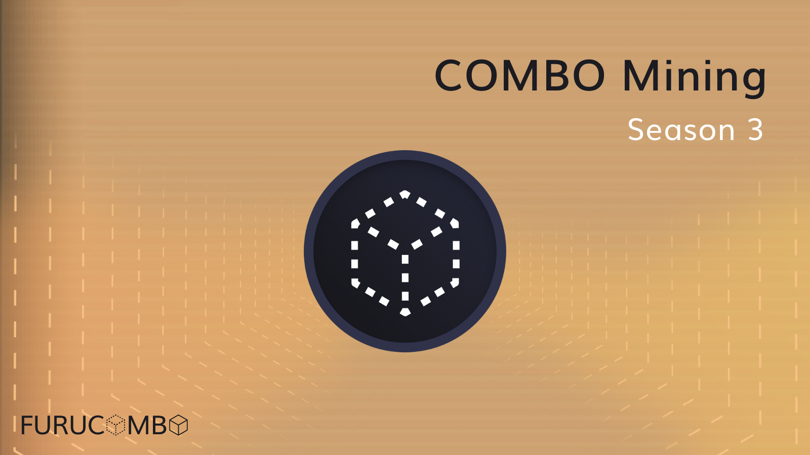
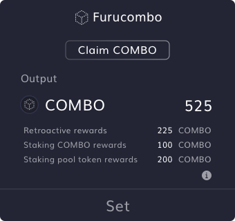

# COMBO Mining Season 3 \(ongoing\)

Season 2 of COMBO mining has ended and we have collected excellent feedback and many great ideas for the third season. With the upcoming releases and breaking news, we couldn't be more excited to share what we have for you in the new season of COMBO mining!

## Furucombo COMBO mining season 3


### COMBO Mining SZN3 Bonus Event — Usage Farming on Polygon!!👩‍🎤 

### **TL;DR** 

📅  Begins: June 24 2021, 3 AM \(UTC\)  
💰  Weekly total rewards: 7,000 $MATIC+14,000 $COMBO  
🏃  Goal: Using [Furucombo](https://furucombo.app/) on Polygon AMAP!  
🍕  Polygon Pizza can boost rewards by 1.2x! \([5th-week challenge](https://docs.furucombo.app/other-faq/combo-mining-season-3)\)  
[👉  **More info**](https://docs.furucombo.app/other-faq/combo-mining-season-3-usage-farming-on-polygon)\*\*\*\*


### **Program period**

May 13 2021, 3:00 AM \(UTC\) — Aug 5 2021, 3:00 AM \(UTC\)

### **How to participate**

There will be two parts in the season 3 program. Each user can decide which part\(s\) to join to earn the weekly rewards.

1. Liquidity Farming: Stake COMBO or COMBO/ETH LP token to earn rewards.
2. Usage Farming: Gas reimbursement + weekly challenge to join NFT lotteries.

### 1. Liquidity Farming

Unlike season 2, this time stakers don’t need to make transactions every week to get the weekly rewards.

* The reward is calculated pro-rata with \(Stake Amount\) x \(Stake duration\).
* Weekly distribution, 6-week vesting
* Weekly budgets: - COMBO Staking: 10,000 COMBO - COMBO/ETH Uni-V2 LP Staking: 77,500 COMBO
* All budgets will be shared with the respective stakers.

To maximize rewards, we recommend that you stake COMBO tokens or COMBO/ETH Uni-V2 LP tokens as soon as you own some. Because the earlier you stake, the bigger your staking area will be, hence higher rewards.

### 2. Usage Farming

Usage Farming aims to encourage people to use and to try out the magic of Furucombo. **This is a basic gas reimbursement program, but users who hold Furucombo NFTs can also boost their rewards up to 2 times.**

* The reward is calculated pro-rata with \(Gas Used\) x \(Gas Price\) x NFT effect / \(COMBO Price in ETH\)
* Weekly distribution, no vesting
* Cap: - 100,000 COMBO as total weekly rewards. If the cap is reached, all rewards will be scaled down together. **- Maximum gas used per address = 1,200,000 gas limit.** This will cover around three transactions on average.
* Which transactions will count? - Basically all transactions you send on the combo page that involve token transfers. - Failed transactions will also count. - Token approvals are not counted because they do not interact with Furucombo. - Using wallets such as Argent and DappLogic will not be counted because the behavior of these wallets is quite unique. - Quick check? If your transaction has the tag “Interacted With \(To\): Furucombo: Proxy vx.x.x” on etherscan, it will be counted.

### **How to get a Furucombo NFT?**

This time we collaborate with our best fren [Lootex](https://lootex.io/stores/furucombo-nft) to issue FuruPizza on Polygon!

* **1st-week challenge: using the Aave cube 👻👻👻** - How: Every address which completes a transaction with any Aave cube will get a chance to win a limited NFT. - When: May 13 2021, 3:00 AM \(UTC\) — May 20 2021, 3:00 AM \(UTC\) - What: There will be 26 out of 30 limited NFTs for the winners in week 1. These NFT holders can boost their rewards starting from week 2.
* **2nd-week challenge: using the Sushiswap cubes 🍣🍣🍣**

  - How: Every address which completes a transaction with any Sushiswap cube will get a chance to win a limited NFT.

  - When: May 20 2021, 3:00 AM \(UTC\) — May 27 2021, 3:00 AM \(UTC\)

  - What: There will be 30 limited NFTs for the winners in week 2. These NFT holders can boost their rewards starting from week 3.

* **3rd-week challenge: using the B.Protocol cubes 🥦🥦🥦** - How: Every address which completes a transaction with any B.Protocol cube will get a chance to win a limited NFT. - When: May 27 2021, 3:00 AM \(UTC\) — June 3 2021, 3:00 AM \(UTC\) - What: There will be 30 limited NFTs for the winners in week 3. These NFT holders can boost their rewards starting from week 4.
* **4th-week challenge: using 4 cubes in one transaction** 🧊🧊🧊🧊

  - How: Every address which completes a transaction with 4 cubes will get a chance to win a limited NFT.

  - When: June 3 2021, 3:00 AM \(UTC\) — June 10 2021, 3:00 AM \(UTC\)

  - What: There will be 30 limited NFTs for the winners in week 4. These NFT holders can boost their rewards starting from week 5.

* **5th-week challenge: Use Polygon network, send out 1 txn.** 💜💜💜

  - How: Every address which completes a transaction on the Polygon network will get a chance to win a limited NFT.

  - When: June 10 2021, 3:00 AM \(UTC\) — June 17 2021, 3:00 AM \(UTC\)

  - What: There will be 30 limited NFTs for the winners in week 5. These NFT holders can boost their rewards starting from week 6. [\*\*This week’s NFT can be used to boost your usage farming rewards on Polygon.](https://docs.furucombo.app/other-faq/combo-mining-season-3-usage-farming-on-polygon)

* **6th-week challenge: using the Curve cubes on the Polygon network 🌈🌈🌈**

  - How: Every address which completes a transaction with any Curve cube on the Polygon network will get a chance to win a limited NFT.

  - When: June 17 2021, 3:00 AM \(UTC\) — June 24 2021, 3:00 AM \(UTC\)

  - What: There will be 30 limited NFTs for the winners in week 6. These NFT holders can boost their rewards starting from week 7.

* **7th-week challenge: using the Token Bridge cube 🌉🌉🌉**

  - How: Every address which completes a transaction with a Token Bridge cube will get a chance to win a limited NFT.

  - When: June 24 2021, 3:00 AM \(UTC\) — July 1 2021, 3:00 AM \(UTC\)

  - What: There will be 30 limited NFTs for the winners in week 7. These NFT holders can boost their rewards starting from week 8.

* Other challenges to win a NFT? - There will be different weekly challenges throughout the mining program. Complete each challenge then you could get a chance to win the NFT. We will announce the weekly challenge on Twitter a few days before each period. - There will be 12 types of NFTs and there will be a special bonus if you are lucky enough to collect all 12 NFTs.
* Previously distributed NFTs can be used in mining season 3 as well - We have already sent out 33 Aave x Furucombo NFTs, if you have one of them, you can boost the usage farming reward by 1.2x. - 4 lottery winners from the Furucombo creativity campaign will get their Furucombo NFT by the end of May, these NFTs can boost 1.2x of the usage farming reward.

### Distribution process

* We will distribute COMBO tokens as rewards on a weekly basis.
* Furucombo team will calculate rewards every Thursday and share the result in our Discord channel for community review.
* If no disputes are raised within 24hrs, the unlocked amount will then be updated to the Furucombo contract \(Typically by Friday night\). You can then claim your rewards through a “Claim COMBO” cube.

That’s it! Enjoy participating in our COMBO mining season 3 and earning COMBO tokens in the following weeks. If you have any questions on this, our team is standing by in [Discord](https://discord.furucombo.app/) to answer any questions. Thanks for participating in the Furucombo community!


[COMBO TX Rewards dashboard](https://go.furucombo.app/reward)  
[Furucombo Dune dashboard](https://duneanalytics.com/Marcov/furucombo-statistics_1)




Things to Note

* This is the third round of the Furucombo mining program in a series. Any future rounds may have different rules and rewards.
* Furucombo reserves the right to change, amend and add new rules agreed by the community during the program period.
* Furucombo is beta software, and it should be treated as highly unstable. Please use it at your own risk.

