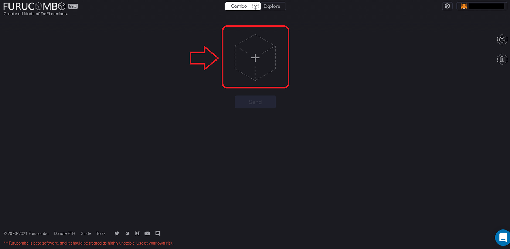
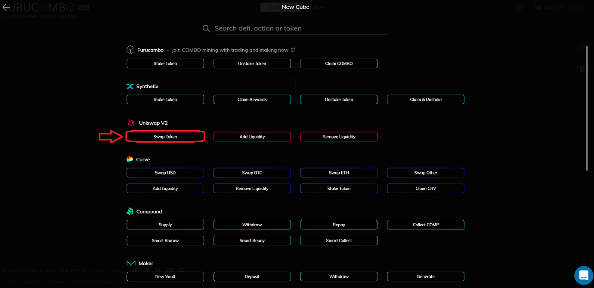
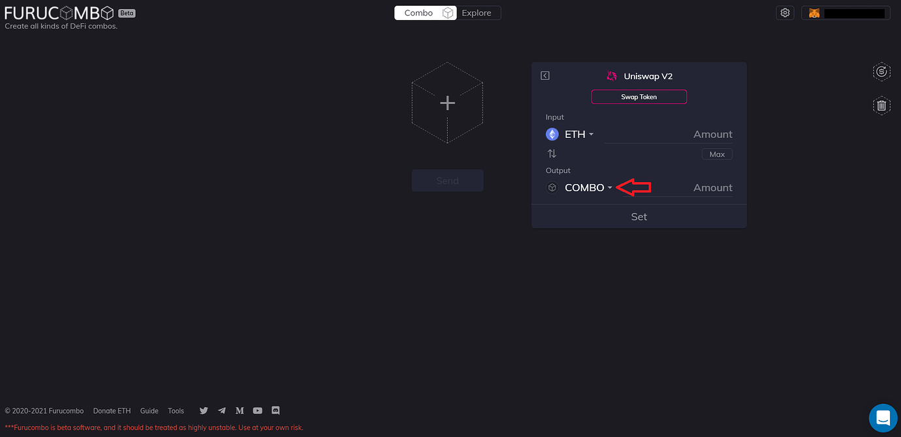
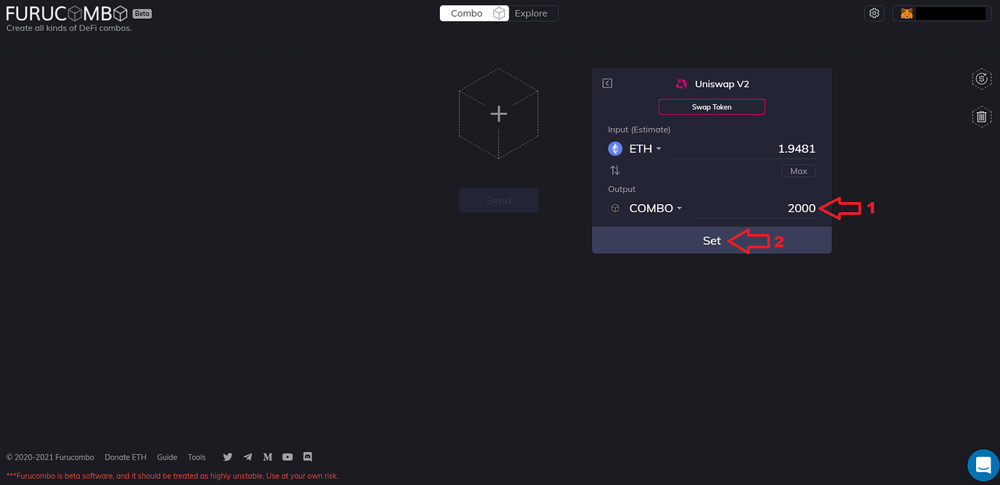
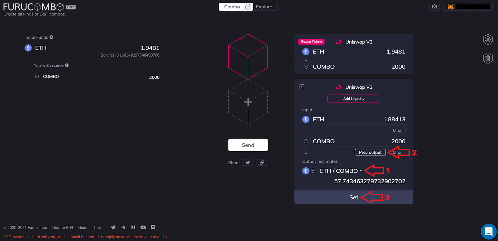
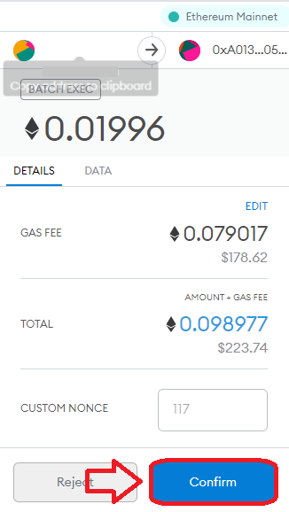

# Hoe te storten voor liquiditeitsmining

Het volgende is een gids over hoe te storten voor het liquidity mining-evenement en een kort overzicht van wat het liquidity mining-evenement is.

## **Wat is liquiditeitsmining?**

* Met het liquidity mining-evenement kunnen gebruikers hun COMBO- of COMBO/ETH LP-tokens storten om COMBO-beloningen te verdienen.
* COMBO-tokens zijn wekelijks beschikbaar voor gebruikers om te verdienen op basis van hoeveel COMBO- of COMBO/ETH-tokens ze hebben gestort. Bovendien, hoe langer een gebruiker gedurende een week in de pool stort, hoe meer hij zal verdienen. Deze wordt wekelijks gereset.
* De historische APY-beloning van week tot week is hier te vinden: [\[OPENBARE\] COMBO TMbeloningen – Google bladen](https://go.furucombo.app/snapshot).
* Historisch gezien hebben gebruikers die hun combo combineren met ETH in de COMBO/ETH LP hogere beloningen, maar moeten ze zich bewust zijn van tijdelijk verlies.

## **Hoe kopen en storten?**

* De [Furucombo-applicatie](https://furucombo.app/) maakt het gemakkelijk om tokens rechtstreeks van Uniswap, 1inch of Sushiswap te kopen.
* We kunnen de kubussen in de Furucombo-applicatie gebruiken om alle transacties samen te voegen tot één transactie, zodat gebruikers kunnen kopen en in de pool kunnen storten.

### **Stap 1**

Klik gewoon op de startknop om blokken toe te voegen

### **Stap 2**

Nu kunnen we onze portemonnee in de rechterbovenhoek aansluiten. De Furucombo-applicatie ondersteunt Metamask, Wallet Connect, Coinbase Wallet, Fortmatic, Portis en Ledger.

### **Stap 3**

Met uw portemonnee verbonden, zijn we klaar om de kubussen toe te voegen. Selecteer een blank kubus uit het midden.

### **Stap 4**

Er wordt een lijst weergegeven met alle Furucombo-kubussen die kunnen worden toegevoegd. Voor deze tutorial zullen we COMBO-tokens kopen van Uniswap, dus voeg de Uniswap V2 'Swap Token'-kubus toe.

### **Stap 5**

Zodra de Uniswap V2 'Swap Token'-kubus is toegevoegd, kunnen we de parameters van de transactie instellen. Deze tutorial gaat ervan uit dat je een aankoop doet met ETH, maar elk token waarmee je COMBO wilt kopen, kan worden toegevoegd aan het gedeelte "Invoer" van de kubus. Klik eenvoudig op de vervolgkeuzepijl naast het uitvoertoken en wijzig deze in COMBO.

### **Stap 6:** 

Voer nu het 'Aantal' tokens in dat u wilt kopen. Voor deze tutorial zullen we 2000 COMBOtokens kopen, dus ik zal 2000 invoeren in het uitvoerbedrag. De kubus vult de waarden in en we kunnen op 'Instellen' klikken.

### Stap 7

Het Uniswap V2-blok 'Swap Token' wordt nu ingesteld en uw hoofdpagina ziet er als volgt uit. We kunnen nu doorgaan met het toevoegen van de volgende kubus, namelijk het toevoegen van liquiditeit aan de Uniswap-liquiditeitspool. Nogmaals, we kunnen op de blank kubus klikken en deze keer zullen we de Uniswap V2-kubus 'Add Liquidity' toevoegen.

### Stap 8

Met de 'Add Liquidity'-kubus toegevoegd, kunnen we de uitvoer resetten vanuit het vervolgkeuzemenu. We zullen ETH/COMBO selecteren door COMBO te zoeken in de zoekbalk en te klikken om de uitvoer aan de kubus toe te voegen. Eenmaal toegevoegd, kunt u de hoeveelheid ETH of COMBO instellen die u wilt poolen. Voor deze zelfstudie gebruiken we de selectie "Vorige uitvoer" om overeen te komen met het aantal COMBO-tokens dat we kopen. De kubus vult de waarden in en we kunnen op 'Instellen' drukken om de kubus aan de hoofdpagina toe te voegen.

### Stap 9

De Uniswap V2-kubus 'Add Liquidity' wordt nu toegevoegd aan de reeks kubussen op de hoofdpagina. De laatste stap is om de Uniswap LP toe te voegen aan het Furucombostakingscontract met behulp van de 'Stake Token'-kubus. Klik nogmaals op de blank kubus en klik vervolgens op de kubus 'Stake Token' in het kubusselectiemenu.

### Stap 10

Met de 'Stake Token'-kubus toegevoegd, kunnen we op de 'Prev output' klikken om de liquiditeitspool-tokens van de vorige kubus naar de invoer van het onderste blok te trekken. Zodra het is ingevuld, klikt u onderaan op de knop 'Instellen'.

### Stap 11

Alle kubussen die nodig zijn om te storten zijn nu toegevoegd aan de hoofdinterface en zien er als volgt uit: We kunnen nu de transactie 'Goedkeuren' en 'Verzenden' door op 'Goedkeuren' en 'Verzenden' te drukken. De details van de transactie verschijnen in uw portemonnee. Om de transactie op Metamask te bevestigen, klikt u op 'Bevestigen'. Houd er ook rekening mee dat de gasprijs 50% is van wat wordt weergegeven in Metamask

En dat is het! Je hebt nu gestort in de pool op Furucombo en kunt beginnen met het bouwen van je stortingsgebied voor liquiditeitsmijnen!

🧊 Special thanks to Blazar for providing this article and [blackcatx](https://twitter.com/gaintodayx) for translating this article!

