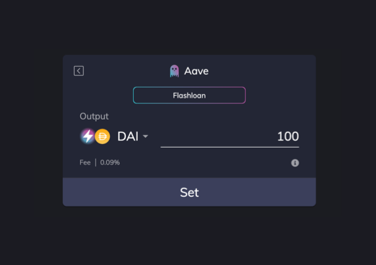
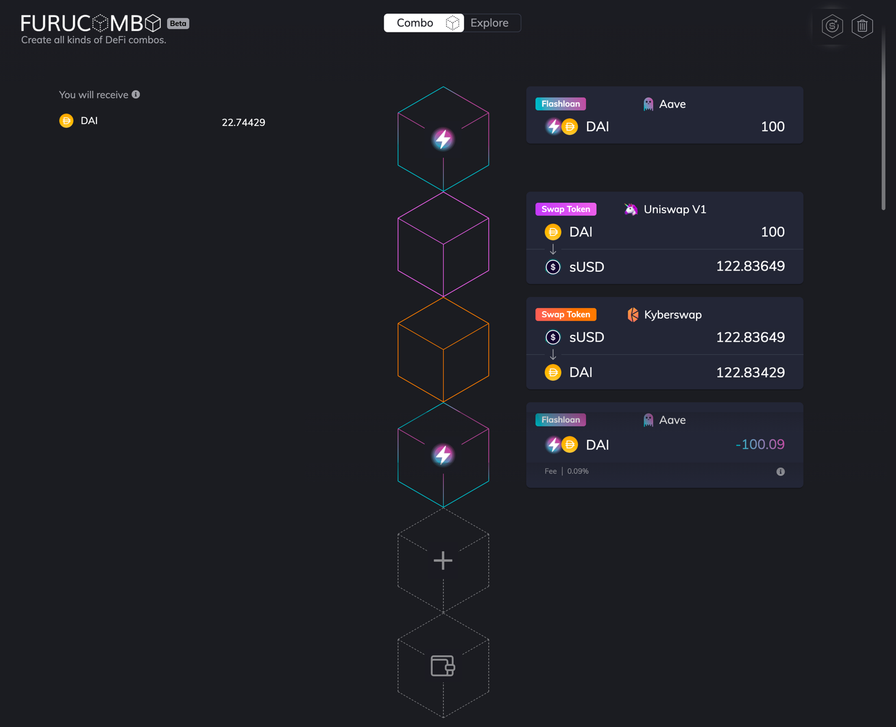

# Flashloan Combo


## **What is Flashloan?** <a id="256b"></a>

Flash Loans are introduced by the [Aave](https://app.aave.com/home), an open-source lending protocol for anyone to deposit and borrow cryptographic assets. Essentially, flashloans let users borrow any amount up to the total liquidity available without any collateral, so long as the loan is repaid in the same transaction. If the loan is not repaid, the whole transaction will be reverted. With flashloan anyone can access a massive amount of liquidity, and use the loan with other protocols however they want. You can become a ‘whale’ without any capital.

At the time of writing, there are three pools providing flashloans:

* **Aave:** 22 tokens available with 0.09% fee
* **dYdX:** 3 tokens available zero fee \*
* **Uniswap V2:** 100+ tokens available with 0.3% fee

```text
*Note that flashloan on dydx is not a consumer feature. 
It is achieved by developers chaining Withdraw, Call and Deposit actions.
```

So, flashloan sounds like a very good deal. What exactly can you use it for? [Marc Zeller](https://twitter.com/lemiscate) from Aave has written a very [nice piece](https://medium.com/aave/sneak-peek-at-flash-loans-f2b28a394d62) demonstrating some of the top use cases for flashloan.

We summarize the use cases:

* Arbitrage trades
* [Collateral swap](https://deflast.finance/)
* Self-hedging
* Self-liquidation
* \(Debt\) Interest rate swap
* \(Debt\) Currency swap

The most popular use case by far is _**Arbitrage trades**_. For those unfamiliar, arbitrage is the strategy of making a profit from price differences between different markets. To make a significant amount of profit, you will need substantial capital to get started. And this, is where the magic happens — We use flashloan to generate free money with no upfront cost.

## Before we get started <a id="65e4"></a>

There are some important things to understand:

> For arbitrage traders, Furucombo lowers the barriers-to-entry for building money legos, providing all the necessary elements to create arbitrage strategies including the so far coder-only flashloans. But, please keep in mind that Furucombo does _**NOT**_ find arbitrage opportunities for you. You will have to find it yourself. ✊🏻

Enough with the disclaimer, let’s get to the checklist. 👇🏻

```text
Find an arbitrage opportunity >0.09% to cover flashloan's fee
Have some ETH in your wallet enough to pay for gas
```

The example we use in the following is an arbitrage opportunity found between KyberSwap and Uniswap V1 a few months ago.

```text
Rate difference: 20+%
1 DAI = 1.2411 sUSD on Uniswap
1 sUSD = 0.9927 DAI on Kyberswap
👉🏻 Buy low sell high: Buy sUSD on Uniswap and sell it on Kyberswap
```

Now you found the rate difference, let’s start creating the combo. The complete combo should look like this:

```text
Borrow 100DAI from Flashloan
Swap 100DAI to 122.83649sUSD on Uniswap
Swap 122.83649sUSD to 122.83429DAI on Kyberswap
Repay 100.09DAI to Flashloan
You keep 22.74429DAI profit.
```

## Step by step <a id="29f4"></a>

### 1. Go to [Furucombo](https://furucombo.app/) <a id="9194"></a>

### 2. Add a Uniswap V1 cube <a id="126f"></a>


```text
1️⃣ Click the cube with '+' symbol 
2️⃣ Choose 'Swap Token' under Uniswap V1 section
3️⃣ Enter Input: 100DAI
4️⃣ Output generated from Uniswap: 122.83649sUSD
5️⃣ Click 'Set'
```

### 3. Add a Kyberswap cube <a id="dcdb"></a>


```text
1️⃣ Click the cube with '+' symbol 
2️⃣ Choose 'Swap Token' under Kyberswap section
3️⃣ Enter Input: 122.83649 sUSD
4️⃣ Output generated from Kyberswap: 122.83429 DAI
5️⃣ Click 'Set'
```


**💡 Tips:** If your input is according to the previous cube's output, enter a slightly lower amount instead of the exact amount. This way, you can avoid combo failure due to rate difference.


### 4. Add Flashloan cube <a id="de6a"></a>



```text
1️⃣ Click the cube with '+' symbol 
2️⃣ Choose 'flashloan' under Aave section
3️⃣ Enter amount: 100DAI
4️⃣ Click 'Set'
5️⃣ Two cubes appear. 1st cube is borrow 100DAI and 2nd cube is payback 100.09DAI.
```

### 5. Drag flashloan’s 1st cube to the top <a id="81e4"></a>

This is simply adjusting the execution order. You want to borrow from flashloan at the very beginning to have the upfront capital. So, just click and drag the borrow cube to the top and keep the payback cube at the bottom.

The final combo would look like...



### 6. Connect wallet <a id="72ba"></a>

### 7. Send out <a id="a283"></a>

🎉 Bravo! You’ve made money with zero capital. _Don’t forget to share your result on Twitter._ 🎉


