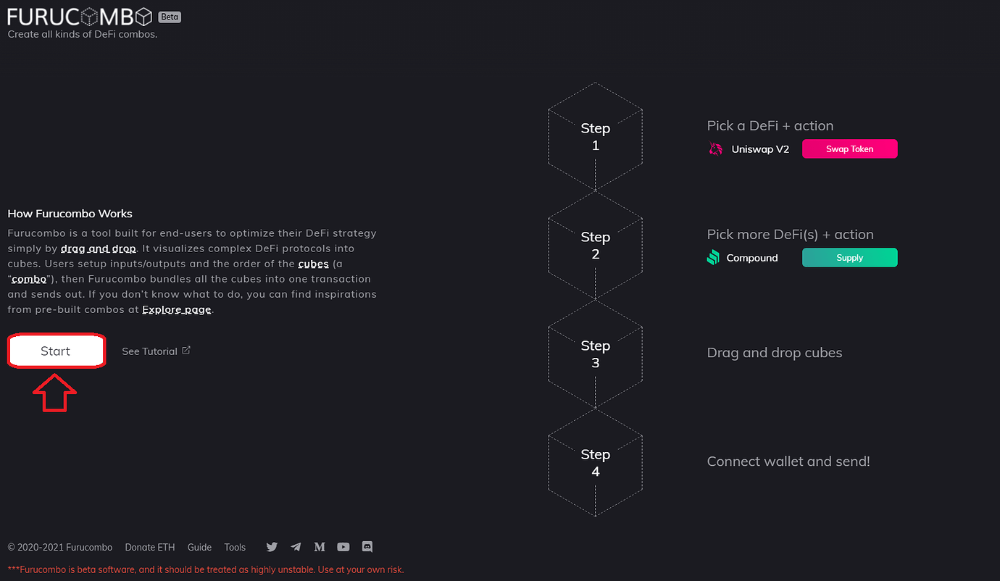
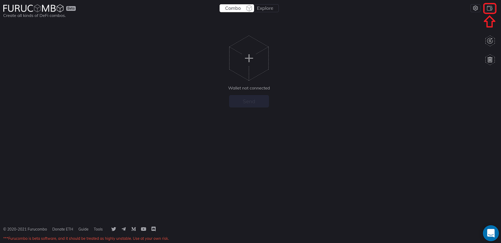
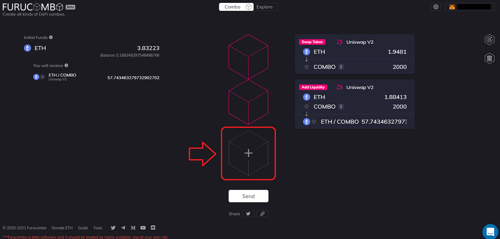
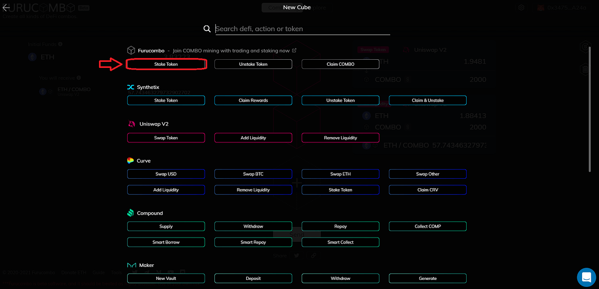
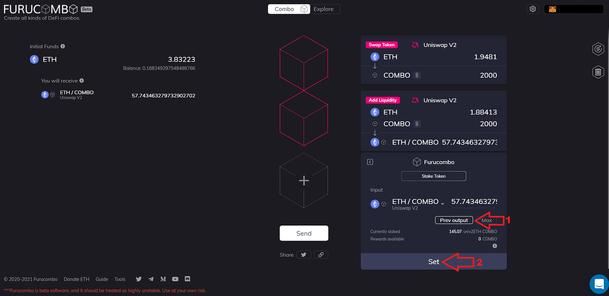
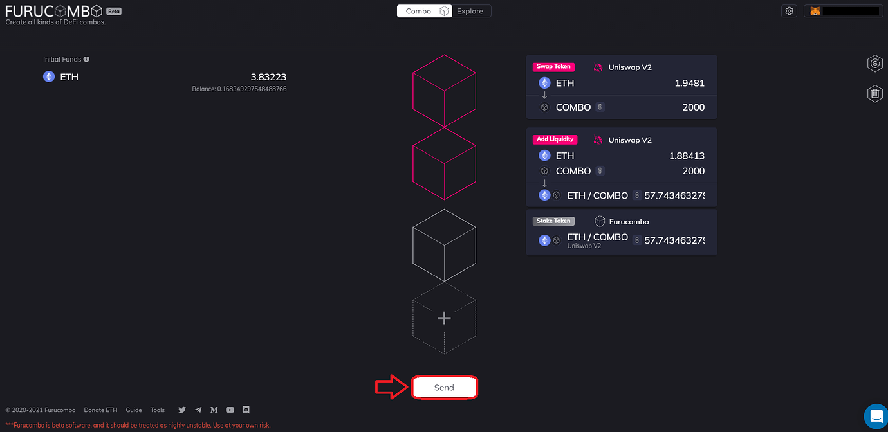

# How to Stake for Liquidity Mining

## **What is liquidity mining?**

* The liquidity mining event allows users to stake their COMBO or COMBO/ETH LP tokens to earn COMBO rewards.
* COMBO tokens are available weekly for users to earn based on how many COMBO or COMBO/ETH tokens they have staked. Additionally, the longer a user stakes during a week, the more they will earn. This is reset weekly.
* For the 2nd phase of liquidity mining, users simply have to do one transaction per week to qualify for these rewards, and rewards are vested over 12 weeks.
* The historical week by week reward APY can be found here: [\[PUBLIC\] COMBO TM Rewards - Google Sheets](https://docs.google.com/spreadsheets/d/1klbuACed44IA4mNUxx8Gcjc9zSg1ZzS2ni54XkKkK3k/edit#gid=1097834621).
* Historically users that pair their combo with eth in the COMBO/ETH LP have higher rewards, but must be aware of impermanent loss.

## **How to buy and stake?**

* The [Furucombo application](https://furucombo.app/) makes it easy to purchase tokens right from Uniswap, 1inch, or Sushiswap.
* We can use the cubes on the Furucombo application to chain together all the transactions into one, which allows users to purchase and stake.

### **Step 1:** 

Simply click the start button to begin adding blocks.

### **Step 2:** 

Now we can connect our wallet in the top right-hand corner. The Furucombo application supports Metamask, Wallet Connect, Coinbase Wallet, Fortmatic, Portis, and Ledger.

### **Step 3:** 

With your wallet connected, we are ready to add the cubes. Select a blank cube from the center.

### **Step 4**

A list will populate, showing all the Furucombo cubes that can be added. For this tutorial, we will purchase COMBO tokens from Uniswap, so add the Uniswap V2 ‘Swap Token’ cube.

### **Step 5**

Once the Uniswap V2 ‘Swap Token’ cube is added, we can set the parameters of the trade. This tutorial will assume you are making a purchase with ETH, but any token you wish to buy COMBO with can be added to the ‘Input’ section of the cube. Simply click the drop-down arrow beside the output token, and change it to COMBO.

### **Step 6:** 

Now, input the ‘Amount’ of tokens you’d like to purchase. For this tutorial, we will purchase 2000 COMBO tokens, so I will input 2000 into the output amount. The cube will populate the values, and we can hit ‘Set’.

### Step 7

The ‘Swap Token’ Uniswap V2 block will now be set, and your main page will look like the following. We can now proceed to add the next cube, which will be to add liquidity to the Uniswap liquidity pool. Once again, we can click the blank cube, and this time we will add the ‘Add Liquidity’ Uniswap V2 cube.

### Step 8

With the ‘Add Liquidity’ cube added, we can set the output once again from the drop down menu. We will select ETH / COMBO by searching COMBO in the search bar and clicking to add the output to the cube. Once added, you can set the amount of ETH or COMBO you would like to pool. For this tutorial we will use the ‘Prev output’ selection to match the amount of COMBO tokens that we are purchasing. The cube will populate the values, and we can hit ‘Set’ to add the cube to the main page.

### Step 9

The ‘Add Liquidity’ Uniswap V2 cube will now be added to the chain of cubes on the main page. The final step is to add the Uniswap LP to the Furucombo staking contract by using the ‘Stake Token’ cube. Once again click the blank cube, and then click the ‘Stake Token’ cube from the cube selection menu.

### Step 10

With the ‘Stake Token’ cube added, we can click the ‘Prev output’ to pull the liquidity pool tokens from the previous cube to the input of the bottom block. Once it populates, simply click the ‘Set’ button at the bottom.

### Step 11

All the cubes required to stake are now added to the main interface, and will look like the following. We can now ‘Approve’ and ‘Send’ the transaction by hitting the ‘Approve’ and ‘Send’. The details of the transaction will appear in your wallet. To confirm the transaction on Metamask, hit ‘Confirm’. Also note that the gas fee is 50% of what is shown in Metamask.

And that’s it! You are now staked to Furucombo and can start building your staking area for the liquidity mining!

🧊 Special thanks to Blazar for providing this article.

