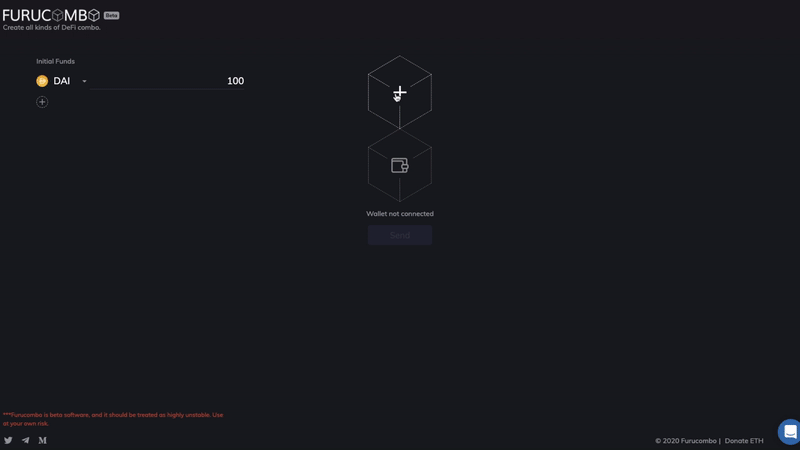
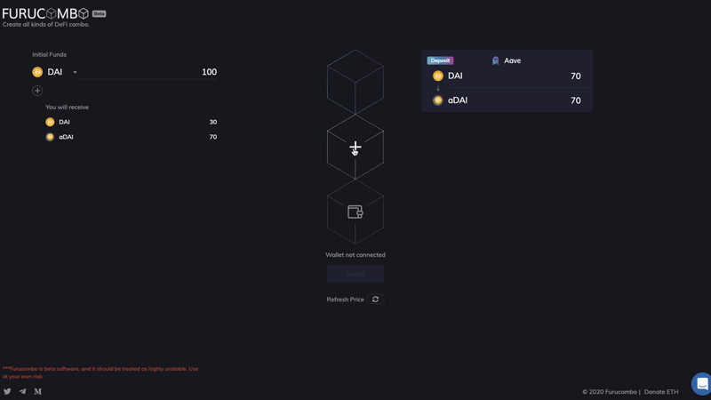
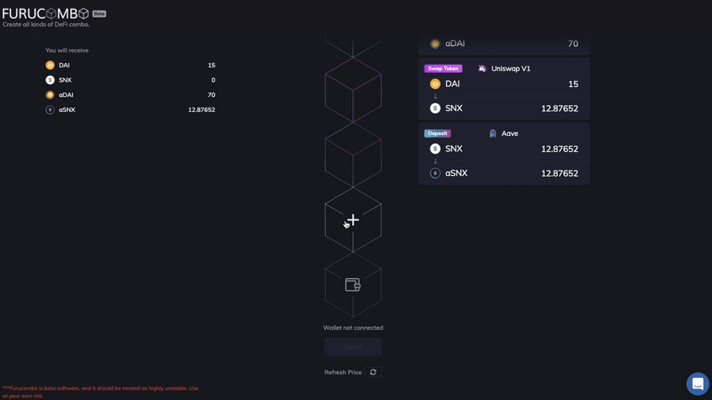

# Passive Income \| Part 1


In this article, we will walk you through how to earn some passive income in the DeFi world. There are many strategies to make passive income, including lending, staking, provide liquidity, mining, lottery pool, etc. The easiest way and the closest thing to “set and forget” approach is simply by holding interest-bearing tokens.

## What are interest-bearing tokens? <a id="120b"></a>

Interest-bearing tokens are representations of the underlying asset that earn interest. When users deposit/supply an asset to lending protocols, they receive interest-bearing tokens in exchange. Just like a receipt, which you can later on redeem your deposits back. These tokens accrue interest every Ethereum block \(~15 seconds\) and can be transferred to anyone. Whoever holds these interest-bearing tokens can redeem them for the principal plus interest at any time.

The most commonly seen interest-bearing tokens are Compound’s cTokens \(e.g. cDAI, cETH, cBAT\) and Aave’s aTokens \(e.g. aDAI, aETH, aBAT\).

### Compound’s cTokens <a id="6387"></a>

At the time of writing, there are eight assets supported on Compound. When you supply assets to Compound you get “**cTokens**” in exchange. For example, you supply 100 DAI then you’ll get 4884.52cDAI. The amount of cToken you get is algorithmically determined based on the exchange rate, which is why it looks a bit hard to understand at first. The cToken exchange rate \(how much DAI one cDAI is worth\) increases at a rate equal to the compounding market interest rate. Over time, each cToken becomes convertible into an increasing amount of its underlying asset, even while the number of cTokens in you wallet stays the same.

So for the previous example, when you redeem your 4884.52cDAI, maybe a year later with 10% interest, you will receive 110DAI.


### Aave’s aTokens <a id="7b79"></a>

At the time of writing, there are 22 assets supported on Aave. When you supply assets to Aave you get “**aTokens**” in exchange. Unlike Compound, Aave’s aTokens are pegged 1:1 to the value of the underlying asset. So for example, if you deposit 100 DAI, you get 100 aDAI. These aTokens accrue interest in real-time directly in users’ wallets. That means the 100aDAI you receive, increases every few seconds. If you come back a year later with 10% interest, you will have 110aDAI in your wallet, which will be redeemable for 110DAI.


## How to get some interest-bearing tokens <a id="ebae"></a>

Now we learn about interest-bearing tokens, time to get some of them. You first need to own the token to be supplied to lending protocols. If you don’t have one, then you need to swap some from an exchange, such as Uniswap, Kyberswap, etc. This whole process can be quite time-consuming.

For example, you see APY for SNX on Aave and WBTC on Compound are very attractive but you only have DAI in your wallet. The complete process will be

```text
1) swap DAI to SNX 
2) swap DAI to WBTC
3) deposit SNX and receive aSNX
4) deposit WBTC and receive cWBTC
```

You can complete all four steps on Furucombo, saving you steps from visiting multiple webpages.

### Step by step

Below we will guide you step by step to complete this process — turning 100DAI into a basket of interest-bearing tokens using Furucombo:

```text
Initial funds: 100DAI
• 70DAI → DAI 3% APY on Aave
• 15DAI → SNX 8.3% APY on Aave
• 15DAI → WBTC 0.25% APY on Compound
```

\*\*\*Tokens allocation is for tutorial demonstration only. It does not represent any recommendation for investment. 

### **✅ Step 1— Supply 70DAI to Aave**



### **✅ Step 2— Swap 15DAI to SNX and deposit to Aave**



### **✅ Step 3— Swap 15DAI to WBTC and supply to Compound**



_The complete cubes set up should look like… 👇🏻_


### **✅ Step 4— Connect Wallet**


### ✅ Last Step — Send <a id="8ad2"></a>


_🎉 Bravo! You start to earn some passive income. Don’t forget to share your result on Twitter. 🎉_


