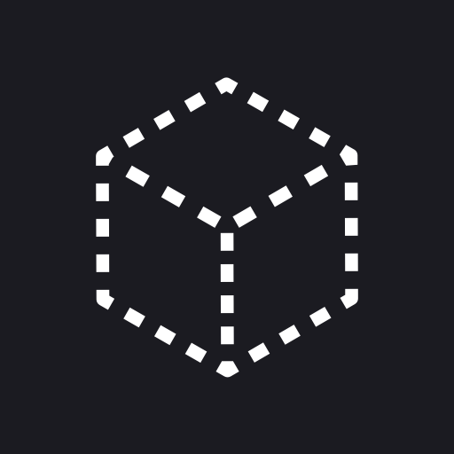
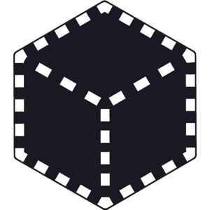
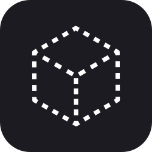

# Brand Assets
























👆 There is actually an image here. It's just transparent that you can't see. 







[https://go.furucombo.app/Furusvg](https://go.furucombo.app/Furusvg)



