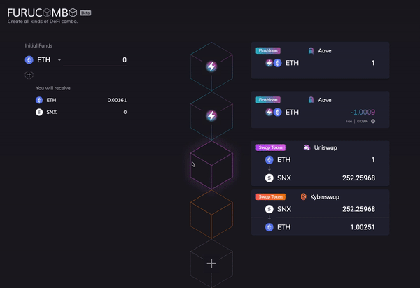
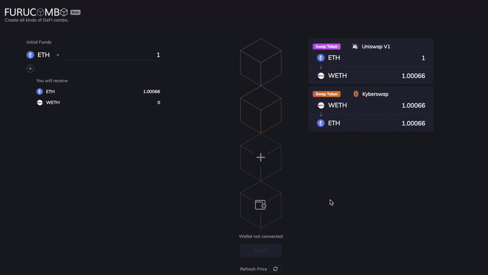
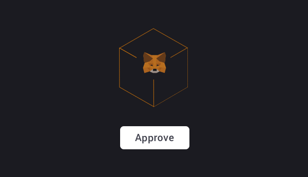

# Guida per principianti

Benvenuto su Furucombo. In questa guida vedremo tutte le basi che devi sapere per creare una combo in modo corretto. Prima di iniziare, vediamo “cos’è Furucombo?”.

Furucombo è uno strumento pensato per gli end-user in grado di ottimizzare la loro strategia DeFi usando semplicemente il drag and drop. E’ come usare i tuoi Lego DeFi ma non hai bisogno di sapere programmare, infatti visualizzerai complessi protocolli DeFi sotto forma di cubi. L’utente deve solamente inserire gli input/output e ordinare i cubi \(noi chiamiamo questo una “combo”\), quindi Furucombo impacchetterà tutti i cubi in un’unica transazione e la eseguirà.Questo è un ottimo strumento per chi esegue azioni tra diversi protocolli, specialmente per chi vuole utilizzare flashloan. \(parliamo di flashloans [qui](https://medium.com/furucombo/create-flashloan-combo-on-furucombo-c7c3b23267f0)\)

Ora che hai un’idea di cos’è Furucombo, iniziamo!

## **Guida all’interfaccia di Furucombo**

### ・**Menu Defi** 

Per iniziare a creare una combo per prima cosa devi selezionare un protocollo DeFi. Clicca “+” su un cubo e quindi si aprirà un menu dei protocolli DeFi. Qui puoi scegliere il protocollo DeFi da utilizzare nella tua combo. Ogni bottone rappresenta un blocco che verrà creato e quindi un’azione che verrà eseguita. La funzione di ricerca in alto ti permette di cercare per protocollo DeFi, azione DeFi \(es. scambia, aggiungi liquidità, ecc…\) oppure il nome di un token che supportato da una certa DeFi.

### ・**Fondi iniziali** 

Quando inizi ad impostare i cubi, potresti vedere in alto a sinistra una sezione chiamata “Initial funds”. Questo indica la quantità di fondi iniziali che devi avere per poter iniziare la transazione.  
  
I fondi iniziali sono spediti direttamente **dal tuo wallet**. Detto ciò, devi avere avere abbastanza token oppure la tua transazione **non** verrà eseguita. Quando il tuo wallet è connesso, il saldo del tuo wallet per ogni token verrà visualizzato qui cosicché tu potrai sempre verificarlo prima di inviare la combo.

### ・**Tu riceverai** 

Sulla sinistra, tu vedi la sezione **“You will receive”**. Questi sono i fondi che riceverai sul tuo wallet alla fine della transazione. Questo è il risultato di tutti gli input e di tutti gli output che hai costruito sulla destra, che è aggiornata ogni volta che cambi un cubo.

## **Passo a passo**

### **Step 1: impostare i cubi** ⚙️ 

Quando selezioni un protocollo, sei costretto ad inserire i dettagli del cubo. Qui vedrai frequentemente i termini “Input” e “Output”.

La fonte di input possono essere i token che hai sul tuo wallet o possono essere gli output dei cubi precedenti. Una volta impostato il cubo, puoi sempre modificarlo o eliminarlo cliccando sulle icone presenti in alto a destra di ogni set.

### **Step 2: drag and drop** 🖱 ✋🏻 📦 

Tutti i cubi che tu imposti sono trasportabili. Semplicemente puoi trascinarli e metterli nell’ordine che preferisci. Quando una combo è inviata, le azioni sono eseguite rispetto all’ordine dei cubi.

> Esempio: Quando crei un flashloan, vedrai apparire una coppia di cubi \(il primo cubo è per prendere in prestito e il secondo per restituire i fondi\). Dopodiché la cosa che devi fare è aggiungere altri cubi \(azioni che vuoi fare con i token presi in prestito\) e trasportarli in mezzo alla coppia di cubi del flashloan.

### **Step 3: Connetti il tuo wallet** 👛 

Puoi creare una combo senza connettere il tuo wallet ma, se vuoi eseguirla, devi connettere il tuo wallet. Semplicemente clicca il cubo con l’icona del portafoglio. Quindi scegli il wallet da connettere.

### **Step 4: Invia una Combo** 🔗 🎉 🎁 

Il procedimento completo per inviare una combo sarebbe:

1️⃣ Cliccare **“Approve”** quando i tuoi fondi iniziali sono token ERC20. Hai bisogno di eseguire questo passaggio una volta per token.

2️⃣ Clicca **“Send”**, e quindi Furucombo farà una stima della tua combo. Se la transazione fallirà, comparirà un messaggio che ti avviserà che puoi cambiare la tua combo. Altrimenti, vedrai una richiesta pop-up sul tuo wallet per confermare la transazione.

3️⃣ Una volta che la tua combo è stata inviata correttamente, il bottone cambia in **“New Combo”** e un messaggio con il link della transazione apparirà. Quando vedi questi cambiamenti, congratulazioni!

Hai completato una combo! Non dimenticarti di condividere i tuoi risultati su Twitter semplicemente cliccando l’icona corrispondente.

Abbiamo anche un video tutorial di questa guida. Guardalo pure! 👇🏻



🧊 Special thanks to Gale for translating this page.

