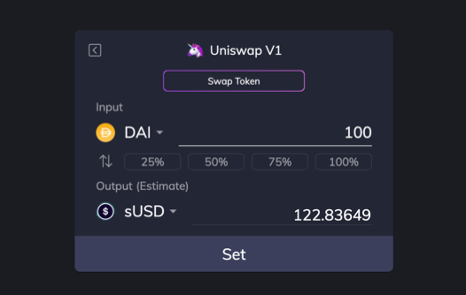
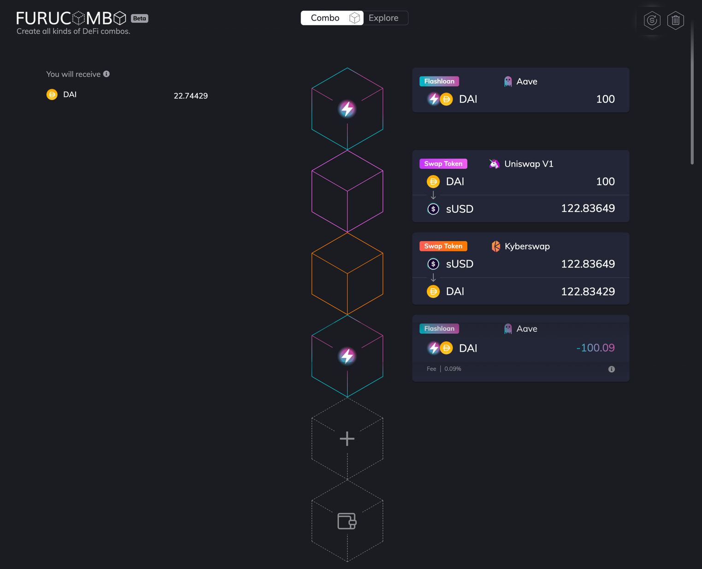

# フラッシュローンコンボ


## フラッシュローンとは?

フラッシュローンは [Aave](https://app.aave.com/home) が導入したオープンソースの貸付プロトコールで、誰でも暗号通貨の資産を貸し借りすることができます。フラッシュローンとは基本的にローン返済がされれば、ユーザーが担保なしで可能な限りの流動資産を借りることができます。もしローンが返済されない場合には、全てのトランザクションが元に戻されます。フラッシュローンにより、誰でも大量の流動資産を利用することができ、他のプロトコールでローンを自由に使用することができます。資産がなくても「クジラ」になる事ができます。

この記事を書いている時点では、3つフラッシュローンを提供しているプールがあります:

* **Aave:** 0.09%の手数料で、22のトークンが利用可能
* **dYdX:** 手数料なしで3つのトークンが利用可能\*
* **Uniswap V2:** 0.3%の手数料で、100以上のトークンが利用可能

```text
*注意。dydxのフラッシュローンはコンシューマー向けの機能ではありません。 
開発者が引出、呼び出し、入金のアクションを連鎖する事で使用できます。
```

フラッシュローンは非常に有益な取引に聞こえますが、実際にはどう使えるでしょうか? Aave の[マーク](https://twitter.com/lemiscate)・ゼラーはフラッシュローンの主な使用例に関して、非常に優れた[記事](https://medium.com/aave/sneak-peek-at-flash-loans-f2b28a394d62)を書いています。

ユースケースを要約:

* アービトラージ取引
* 担保スワップ
* セルフヘッジ
* 自己清算
* （負債）金利スワップ
* （負債）通貨スワップ

一番人気のある使用例はアービトラージ取引です。アービトラージに馴染みのない人の為に、アービトラージとは各マーケット間での価格差を利用して利益を上げる戦略です。この方法で大量の利益を上げるためには、大量の資産を必要とします。フラッシュローンの魔法はここに起こります。フラッシュローンを使うことで初期費用が無くてもお金を生み出すことができます。

## 始める前に

重要な事項を理解する必要があります:

> アービトラージ取引の場合は、フルコンボがアービトラージ戦略に必要なコードのみフラッシュローンなど、全ての要素をマネーレゴのように構築することで、参入障壁を低めています。ただし、フルコンボはアービトラージのチャンスを見出することはありませんので、ユーザーがアービトラージの機会を見つける必要があります。 ✊🏻

免責事項は以上です、こちらがチェックリストです。 👇🏻

```text
0.09%のフラッシュローン手数料をカバーできるアービトラージの機会を見つける
ガス代を払うために必要なETHをウォレットに準備
```

以下の例は、数カ月前のKyberSwapとUniswap V1間で見つかったアービトラージ使用例です。

```text
レート差：20％以上
1 DAI が Uniswap で 1.2411 sUSD
1 sUSD が Kyberswap で 0.9927 DAI
👉🏻 安く買って高く売る：Uniswap でsUSDを購入し、Kyberswap で売却する
```

レート差が見つかったので、コンボを作成します。完成したコンボはこのようになります:

```text
フラッシュローンで 100DAI を借りる
Uniswapで 100DAI を1 22.83649 sUSD にスワップ
Kyberswap で 122.83649 sUSD を 122.83429 DAI
100.09 DAI のフラッシュローン返済
22.74429DAIの利益。
```

## ステップ・バイ・ステップ

### 1. [フルコンボに移動](https://furucombo.app/) <a id="9194"></a>

### 2. Uniswap V1キューブを追加 <a id="126f"></a>



```text
1️⃣ キューブにある「+」記号をクリック
2️⃣ Uniswap V1セクションにある「Swap Token」を選択
3️⃣ 100DAIを入力
4️⃣ Uniswap: 122.83649sUSD が表示される
5️⃣ 「Set」をクリック
```

### 3. Kyberswapキューブを追加 <a id="dcdb"></a>


```text
1️⃣ キューブにある「+」記号をクリック 
2️⃣ Kyberswapセクションにある「Swap Token」を選択
3️⃣ 122.83649 sUSDを入力
4️⃣ Kyberswap: 122.83429 DAIが表示される
5️⃣ 「Set」をクリック
```


**💡 ヒント**: もしインプットがその前のキューブのアウトプットに作用される場合は、同じ量ではなく少し少ない量を入力してください。そうすることで、レート差によるコンボの失敗を防ぐことができます。


### 4. フラッシュローンキューブを追加 <a id="de6a"></a>


```text
1️⃣ キューブにある「+」記号をクリック 
2️⃣ Aaveセクションにある「flashloan」を選択
3️⃣ 100DAIを入力
4️⃣ 「Set」をクリック
```

### 5. フラッシュローンのキューブを一番上にドラッグします <a id="81e4"></a>

これは単に実行順序を調整するためです。最初にフラッシュローンからの借り出しをして、初期費用の資金にします。借り出しキューブをクリックして一番上にドラッグして、返済キューブを一番下にします。

完成コンボはこのようになります...



### 6. ウォレットを接続 <a id="72ba"></a>

### 7. 送信 <a id="a283"></a>

🎉 ブラボー! ゼロ資金でお金を稼ぐことができました。この結果を忘れずにツイッターにシェアして下さい。 🎉


🧊 Special thanks to [@tomoyanTweet](https://twitter.com/tomoyanTweet) for translating this page.

