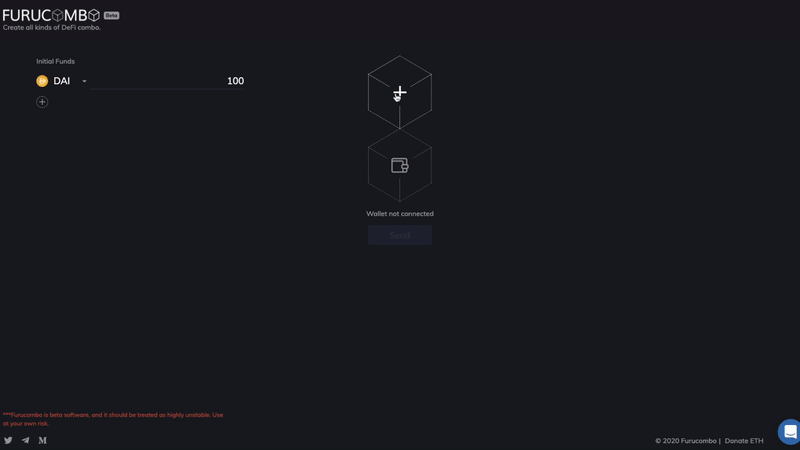
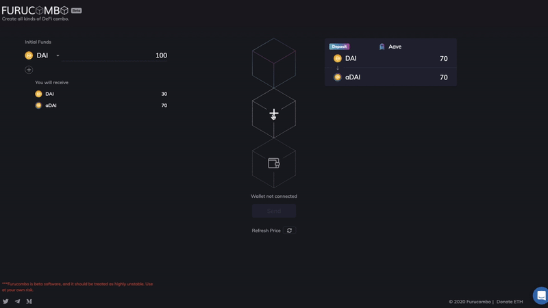
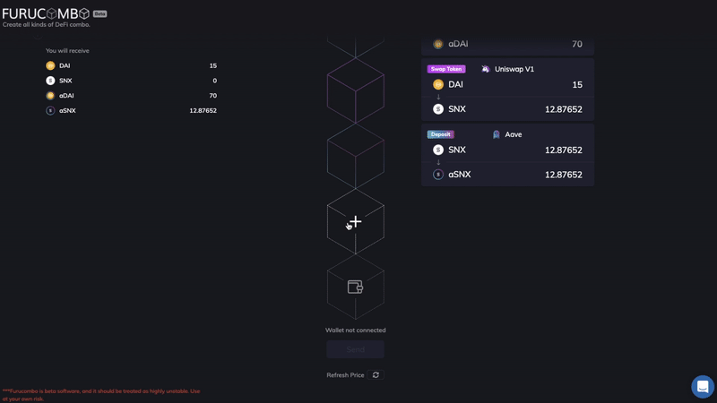
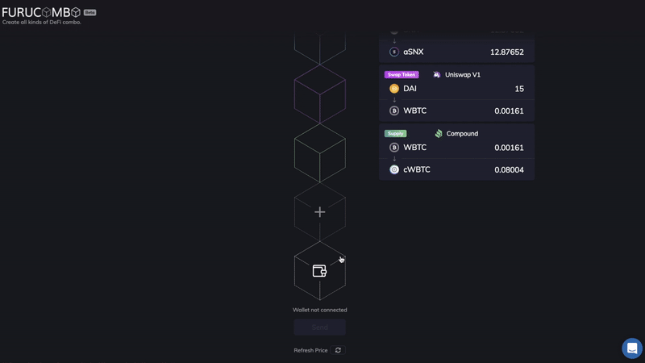
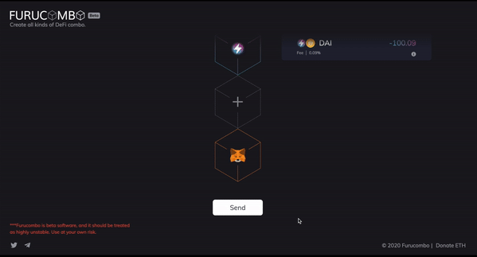

# Ingresos pasivos \| Parte 1


## ¿Qué son los tokens que devengan intereses?

Los tokens que devengan intereses son representaciones del activo subyacente que generan intereses. Cuando los usuarios depositan / suministran un activo a los protocolos de préstamo, reciben a cambio tokens que devengan intereses. Al igual que un recibo, que luego puede canjear sus depósitos. Estos tokens acumulan interés en cada bloque de Ethereum \(~ 15 segundos\) y se pueden transferir a cualquier persona. Quien posea estos tokens que devengan intereses podrá canjearlos por el capital más los intereses en cualquier momento.

Los tokens que generan intereses más comunes son los cTokens de Compound \(por ejemplo, cDAI, cETH, cBAT\) y los aTokens de Aave \(por ejemplo, aDAI, aETH, aBAT\).

### **CTokens de Compound**

En el momento de redactar este artículo, hay ocho activos admitidos en Compound. Cuando proporcionas activos a Compound, obtienes "**cTokens**" a cambio. Por ejemplo, si proporciona 100 DAI, obtendrá 4884,52 cDAI. La cantidad de cToken que obtienes se determina algorítmicamente en función del tipo de cambio, por lo que parece un poco difícil de entender al principio. El tipo de cambio cToken \(cuánto vale DAI frente un cDAI\) aumenta a una tasa igual a la tasa de interés compuesto del mercado. Con el tiempo, cada cToken se convierte en una cantidad cada vez mayor de su activo subyacente, incluso si la cantidad de cTokens en su billetera permanece igual.

Entonces, para el ejemplo anterior, cuando canjee su 4884.52 cDAI, tal vez un año después con un interés del 10%, recibirá 110 DAI.


### **aTokens de Aave**

En el momento de redactar este artículo, hay 22 activos admitidos en Aave. Cuando proporcionas activos a Aave, obtienes "**aTokens**" a cambio. A diferencia de Compound, los aTokens de Aave están vinculados 1: 1 al valor del activo subyacente. Entonces, por ejemplo, si deposita 100 DAI, obtiene 100 aDAI. Estos tokens acumulan interés en tiempo real directamente en las billeteras de los usuarios. Eso significa que los 100 aDAI que recibe aumenta cada pocos segundos. Si regresa un año después con un 10% de interés, tendrá 110 aDAI en su billetera, que se podrá canjear por 110 DAI.


## **Cómo conseguir algunos tokens que devengan intereses**

Ahora que aprendimos sobre los tokens que generan intereses, es hora de conseguir algunos de ellos. Primero debe poseer el token que se suministrará a los protocolos de préstamo. Si no tiene uno, entonces debe cambiar algunos en un Exchange, como Uniswap, Kyberswap, etc. Todo este proceso puede llevar bastante tiempo.

Por ejemplo, ve que el APY para SNX en Aave y WBTC en Compound son muy atractivos, pero solo tiene DAI en su billetera. El proceso completo será

```text
1) cambiar DAI a SNX
2) cambiar DAI a WBTC
3) deposita SNX y recibe aSNX
4) deposite WBTC y reciba cWBTC
```

Puede completar los cuatro pasos en Furucombo, lo que le ahorra visitar varias páginas web.

### **Paso a paso**

A continuación, lo guiaremos paso a paso para completar este proceso, convirtiendo 100 DAI en una canasta de tokens que devengan intereses usando Furucombo:

```text
Fondos iniciales: 100 DAI
• 70 DAI → DAI 3% APY en Aave
• 15 DAI → SNX 8.3% APY en Aave
• 15 DAI → WBTC 0.25% APY en Compound
```

\*\*\*La asignación de tokens es solo para demostración del tutorial. No representa ninguna recomendación de inversión. 

### **✅** Paso 1: Suministrar 70 DAI a Aave



### **✅** Paso 2— Cambie 15 DAI a SNX y deposite en Aave



### **✅** Paso 3— Cambie 15 DAI a WBTC y suministre a Compound



_La configuración completa de los cubos debería verse así ... 👇🏻_


### **✅** Paso 4: Conectar Billetera



### ✅ Último paso - Ejecutar <a id="8ad2"></a>



_🎉_ ¡Bravo! comenzaste a obtener ingresos pasivos. No olvide compartir su resultado en Twitter._🎉_


🧊 Special thanks to [Crypto Lunatico](https://www.youtube.com/c/CryptoLunatico) for translating this page.

