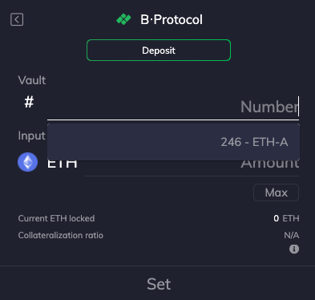

# Combo Pagina

## ● Synthetix-kubussen

### Hoe stort ik op Synthetix?

We hebben een diepgaande zelfstudie waarin wordt uitgelegd hoe u een Synthetix Stakecombo kunt maken. [Lees hier](https://medium.com/furucombo/tutorial-synthetix-cubes-29dcc7a2fcdc)

### Hoe kan ik mijn beloningen verwijderen, claimen of bekijken na het gebruik van Synthetix Stake?

Het gebruik van Furucombo's Synthetix Stake Token-kubus leidt je naar uitzetten via het adaptercontract van Furucombo. Dus als u uw geld wilt verwijderen, het wilt claimen of beloningen wilt zien na de operatie, moet u ook Furucombo gebruiken

## ● Uniswap V2 kubussen

### Ik kan de token/pool die ik wil niet vinden

We ondersteunen de functie voor het importeren van tokens op Uniswap V2-kubussen. Plak het tokenadres/pooltokenadres in de zoekbalk.

### Kan ik WETH direct inwisselen?

Helaas is het gebruik van WETH als input/output in Uniswap V2-cubes niet beschikbaar op Furucombo. Als alternatief kunt u de WETH-kubus onder het hulpprogramma gebruiken om eerst WETH-ETH te converteren.

### Wat is de slippage ingesteld op Uniswap?

De standaard is ingesteld op 3%.

## ● Aave kubussen

### Hoe gebruik je een flitslening?

We hebben een grondige gids voor het maken van een flashloan-combo. [Lees hier](https://medium.com/furucombo/create-flashloan-combo-on-furucombo-c7c3b23267f0)

### Waarom staat er "er is iets mis in de flashloan-kubussen"?

Wanneer u op de verzendknop drukt, schat Furucombo uw combo in de volgorde van uw kubusconfiguratie. Wanneer je de foutmelding krijgt "er is iets mis in de flitslening", betekent dit dat de transactie zal mislukken bij het uitvoeren van kubussen binnen het flitsleenpaar.

De meest voorkomende fout is dat de prijs is veranderd in de kubussen in het flashloan-paar. Druk in dat geval op de knop Prijs verversen.

Je kunt ook proberen de flashloan-kubussen te verwijderen en nogmaals op verzenden drukken om te zien welke kubus de fout heeft.

### Waarom moet ik 0,09% kosten betalen?

Voor het gebruik van de flitslening wordt 0,09% rechtstreeks aan Aave betaald. Furucombo rekent momenteel geen kosten.

### Waarom kan ik Aave blokjes niet in een flitslening zetten?

Dit is een beperkende instelling van Aave. Wanneer u gebruik maakt van een flitslening, neemt u de liquiditeit van Aave. Dat doet het niet heeft het toch zin om het geleende geld te gebruiken met de geleende pool?

### Hoe leen ik bij Aave?

Voordat u gaat lenen, moet u eerst het als onderpand gebruikte actief op Aave storten. Vervolgens kunt u de Aave-leenkubus gebruiken om fondsen te lenen. Selecteer het actief dat u wilt lenen en stel het benodigde bedrag in op basis van uw beschikbare deposito's die als onderpand voor de lening worden gebruikt.

### **Hoe betaal ik mijn schuld bij Aave terug?**

U kunt eenvoudig de terugbetalen kubus van Aave gebruiken om uw schuld af te lossen. Selecteer het activum, stel het terug te betalen bedrag in en bevestig de transactie

### **Wat zijn leen-variabele en leen-stabiele opties?**

De leenvariabele is een tarief op basis van vraag en aanbod in Aave. Het zal veranderen afhankelijk van de marktomstandigheden. 

Lenen stabiel is een korte termijn vaste rente, maar kan op lange termijn worden aangepast in reactie op veranderingen in de marktomstandigheden.

## ● Maker kubussen

### Wat is een gewelf?

De Maker Vault is een kerncomponent van het Maker Protocol, dat het genereren van DAI tegen vergrendeld onderpand vergemakkelijkt. Alle DAI die in omloop zijn, zijn gemaakt door Vaults. Vault-gebruik verandert gezamenlijk de hoeveelheid DAI. Gebruikers creëren DAI door het te genereren tegen hun onderpand en vernietigen op hun beurt DAI bij het terugbetalen van hun gegenereerde DAI-saldo.

Gewelf zijn niet gratis te gebruiken en brengen inherente risico's met zich mee. Het genereren van DAI vereist de betaling van Stabiliteitsvergoedingen \(SF\). De SF is een variabel tarief en kan worden gewijzigd op basis van de beslissingen van MKR Token-houders door middel van stemmen.

Om zekerheden te recupereren, moeten gebruikers de eerder gegenereerde DAI en opgebouwde SF terugbetalen.

Vaults moeten overcollateralized zijn en een liquidatieratio hebben die Vault-eigenaren moeten handhaven om de liquidatie van hun Vaults te voorkomen. Wanneer een Vault wordt geliquideerd, wordt een liquidatieboete toegepast en wordt onderpand verkocht om het uitstaande DAI-saldo van de Vault terug te betalen. Daarnaast wordt er wereldwijd een schuldplafond opgelegd aan het Maker Protocol, maar ook individueel aan elk Vault-type.

### Waar haal ik mijn gewelf nummer vandaan??

Als je al een gewelf hebt, verbind je portemonnee eerste en kies vervolgens een Maker-kubus behalve "Nieuwe gewelt". U ziet uw gewelf nummer weergegeven wanneer u op de gewelf klikt \#blank.

Als u New Vault-kubus gebruikt om een gewelf te maken. U krijgt het gewelfnummer nadat de combo met succes is verzonden. Kom dan terug en kies een Maker-kubus behalve "Nieuwe gewelf" om je gewelfnummer te zien.

### Wat is Oasis Trade?

Oasis Trade wordt gelanceerd door Maker. Het is een liquiditeitspool op de Ethereumblockchain. Simple Market en Matching Market slimme contracten zorgen voor de betrouwbare atomaire uitwisseling van ERC20-tokens zonder tegenrisico van derden.

### Hoe kunt u profiteren van het verplaatsen van de CDP naar Compound?

Dit is een COMBO voor gebruikers die al een kluis op Maker hebben, zodat ze de tokens gemakkelijk naar Compound kunnen verplaatsen. Het is niet per se een winstgevende COMBO. Meer als een COMBO voor activabeheer voor Maker.

## ● Curve kubussen

### Kan ik de pool kiezen om te ruilen?

Je kunt het zwembad op Curve niet kiezen. Wanneer u Curve's Swap Token-kubus gebruikt, kiest Curve automatisch de beste pool voor u.

### Wat is de slippage ingesteld op Curve?

De standaard is ingesteld op 3%.

### Mijn Claim CRV-combinatie werkt niet

Wanneer je Claim CRV gebruikt, gaat het geclaimde CRV-token rechtstreeks naar je portemonnee. Dus als je de CRV-tokens in de volgende kubussen wilt gebruiken, moet je een "Add Funds"-kubus invoegen als de volgende kubus met CRV als invoer

## ● 1inch kubussen

### Ik kan het token dat ik wil niet vinden, maar ik kan het vinden op 1 inch

Tokens op Furucombo worden geselecteerd door het Furucombo-team. Als je het gewenste token niet kunt vinden, laat het team dan weten op Discord \#feedbackchannel.

### Wat is de slippage op die kubus van 1inch?

De standaard is ingesteld op 3%.

### Ik gebruik 1inch in mijn combo, maar hij blijft maar zeggen dat het zal mislukken

Er is een bekend inconsistent probleem bij het gebruik van 1 inch. Hier is een tijdelijke oplossing voor uw referentie:

* Ga naar 1inch.exchange om te zien welke swapservice zij gebruiken in de route voor jouw

  swappaar. Stel dat je ziet dat het via Uniswap V2

* Kom terug naar Furucombo en vervang de kubus van 1 inch door Uniswap V2

## ●  Compound kubussen

### Hoe betaal ik alle schulden op Compound terug?

Stel een hoger aflossingsbedrag in dat hoger is dan de schuld en Furucombo zal alle schulden exact terugbetalen en de rest van het token aan je teruggeven

### Hoe kan ik liquideren op Compound?

We hebben een [kant-en-klare combinatie](https://furucombo.app/combo/bt49ulfm1503gp5r5keg?refreshPrice=1) voor je, die je ook op onze [Explore-pagina](https://furucombo.app/explore/combo_compound_00004) kunt vinden voor toekomstig gebruik.

### Wat zijn Compound slimme kubussen? \(Slim lenen/ Slim terugbetalen/ Slim incasseren\)

De slimme kubussen zijn geavanceerde functies op Furucombo en alleen gebruikers met een DSProxy slimme portemonnee kunnen gebruik ze. U kunt binnen 3 transacties eenvoudig een DSProxy smart wallet maken op Furucombo, en u kunt sla 1 over als je ooit een gewelf hebt gemaakt op Maker of een slimme portemonnee op DeFi Saver.

Nadat u de slimme portemonnee hebt gemaakt en uw Compound onderpand-en-schuldpositie hebt gemaakt, ziet u een positiedashboard op het tabblad Portefeuille en kunt u de Compound slimme kubussen gebruiken om de positie te bewaken en te beheren.

## ●  Kyberswap-kubus

### Ik kan het token dat ik wil niet vinden op Furucombo, maar ik kan het wel vinden op Kyberswap

Tokens op Furucombo worden geselecteerd door het Furucombo-team. Als je het gewenste token niet kunt vinden, laat het team dan weten op Discord \#feedbackchannel.

### Wat is de slippage-instelling op Kyberswap?

De standaard is ingesteld op 3%.

## ● Balancer kubussen

### Ik kan de token/pool die ik wil niet vinden

Tokens op Furucombo worden geselecteerd door het Furucombo-team. Als je het gewenste token niet kunt vinden, laat het team dan weten op Discord \#feedbackchannel.

### Hoe onderzoek ik het zwembad met Balancer?

1️⃣ Controleer de eerste zes cijfers van het pooladres.

2️⃣ Controleer het gewicht van de activa in de pool

### Wat zijn Single-Asset en All-Assets opties?

Bij het toevoegen/verwijderen van liquiditeit aan/uit Balancer, ziet u de opties Alle activa en Enkele activa bovenaan. Laten we als voorbeeld de pool WETH 50%/WBTC 50% nemen:

* Liquiditeit toevoegen - **Alle activa**: U levert alle activa in de pool proportioneel in de gewichten van de pool. 
  * 👉 Je stuurt 1 WETH en 0.0285WBTC naar Balancer en je ontvangt 0.02283BPT token
* Liquiditeit toevoegen - **één activum**: u verstrekt slechts één type token aan de pool. Balancer zal het door u verstrekte token proportioneel omwisselen om liquiditeit aan de pool toe te voegen.
  * 👉 Je stuurt 1 WETH naar Balancer en je ontvangt 0.01105BPT token.

## ● B.Protocolkubussen

B.Protocol is een backstop-liquiditeitsprotocol dat bovenop DeFi-leningsplatforms is gebouwd. Momenteel ondersteunt Furucombo B.Protocol-integratie met Maker, en we zullen later uitbreiden naar Compound en Aave.

### Waar haal ik mijn gewelfnummer vandaan??

Als u al een gewelf heeft, sluit u eerst uw portemonnee aan en kiest u vervolgens een willekeurige B.Protocol-kubus behalve "Nieuwe gewelf". U ziet uw gewelfnummer weergegeven wanneer u op de gewelf \# blank.

Als u Nieuwe gewelf gebruikt om een gewelf te maken. U krijgt het gewelfnummer nadat de combo met succes is verzonden. Dan kom je terug en kies je een willekeurige B.Protocol-kubus behalve "Nieuwe gewelf" om je gewelfnummer te zien.

## ● Nutskubussen

### Wat is verzendtoken?

Zoals het zegt, kunt u met de Token-kubus een token naar het opgegeven adres sturen. Enkele use-cases kunnen zijn:

* Token naar meerdere adressen verzenden
* Stuur meerdere tokens naar één adres
* Verplaats al je stoffiches naar een andere portemonnee

### Wat is WETH?

Wanneer u ETH "wikkelen", wikkelt u niet zozeer in als handel via een slim contract voor een gelijk token genaamd WETH. Als je gewone ETH terug wilt krijgen, moet je het "uitpakken". AKA ruilt het in voor gewone ETH.

Ga voor meer informatie over WETH naar[ weth.io](https://weth.io/)

### Wat is Fondsen toevoegen?

De Add Funds-kubus wordt gebruikt wanneer u ETH of tokens naar Furucombo moet verzenden tijdens de uitvoering van een combo. 

Als u bijvoorbeeld uw CRV wilt claimen en deze wilt inwisselen voor DAI, moet u 'Fonds toevoegen' gebruiken om de Combo te voltooien. Dit komt omdat wanneer je CRV claimt, de geclaimde CRV-tokens rechtstreeks naar je portemonnee gaan, maar niet naar Furucombo. Om die CRV naar Uniswap te kunnen blijven sturen, moet je eerst de CRV naar Furucombo sturen. Zie hieronder de juiste opstelling.

### Wat is Return Funds?

Return Funds-kubus wordt gebruikt wanneer u ETH of tokens naar uw portemonnee wilt retourneren tijdens de uitvoering van de Combo. Hoewel Furucombo alle fondsen terugstuurt naar gebruikers na het voltooien van de combo, moet in sommige gevallen Return Funds worden toegevoegd om de combo met succes uit te voeren.

U wilt bijvoorbeeld uw zekerheden op Compound ruilen \(zie onderstaande afbeelding\), bijvoorbeeld cDAI naar cETH. Wanneer je ETH leent van flashloan en de ETH aan Compound levert, wordt de cETH die je in de tweede kubus ziet, daadwerkelijk naar Furucombo's proxy gestuurd. Je cDAI is vergrendeld totdat je genoeg cETH hebt om je schuld te ondersteunen, dus hier hebben we de "Return Funds"-kubus nodig die cETH overdraagt van Furucombo's proxy naar je portemonnee. En in de volgende kubus verplaats je je cDAI naar Furucombo's proxy door "Add Funds" kubus!

### Wat is Gas Saver?

Gas Saver-kubus wordt gebruikt wanneer u enkele CHI- of GST2-tokens in uw portemonnee heeft. Wanneer je ze verbrandt \(vooral tegen een hoge gasprijs\), krijg je een deel van de gaskosten terug, waardoor het goedkoper is dan dezelfde transactie zonder GasToken. Bekijk de onderstaande links voor meer informatie over gastokens:

* [GasToken.io](https://gastoken.io/#:~:text=GasToken%20is%20a%20new%2C%20cutting,gas%20when%20it%20is%20expensive.)
* [CHI token by 1inch ](https://medium.com/@1inch.exchange/everything-you-wanted-to-know-about-chi-gastoken-a1ba0ea55bf3)

## 🧠 Arbitrage strategieën

### Wat is arbitrage?

In veel opzichten is crypto-arbitrage net als fiat- of sportarbitrage. Het belangrijkste idee hier is eenvoudig: u probeert te profiteren van prijsverschillen voor hetzelfde activum in verschillende markten of beurzen.

Investopedia beschrijft arbitrage als "de gelijktijdige aan- en verkoop van een actief om te profiteren van een prijsonevenwichtigheid. Het is een transactie die winst maakt door gebruik te maken van de prijsverschillen van identieke of vergelijkbare financiële instrumenten in verschillende markten of in verschillende vormen."

Met andere woorden, **koop laag en verkoop hoog!**

Verwante lectuur: 

* [Arbitrage in DeFi door The Block](https://www.theblockcrypto.com/post/45750/exploring-defi-trading-strategies-arbitrage-in-defi)

### Hoe ziet een winstgevende combo eruit?

* Er is geen initiële fondsen


Als u de initiële fondsensectie ziet verschijnen, betekent dit dat dit geen winstgevende combo is. Het ergste geval is dat u het initiële fondsen verliest en niets terugkrijgt.


* Jij ontvangt
  * Activa die in deze sectie worden getoond, zijn winsten uit de Combo.

### Hoe maak je een winstgevende combo?

* Allereerst moet u een arbitragemogelijkheid vinden.
* Rekening houdend met de gaskosten, kosten arbitragecombo's meer dan gemiddelde combo's vanwege de complexiteit van de acties. Dit is een primaire kostenfactor die de winstgevendheid van de handel beïnvloedt.
* Onthoud dat er altijd veel front-running transacties van bots zijn. Er is dus een kans dat uw Combo-arbitragemogelijkheid door de bots wordt uitgebuit.
* Arbitrage combo's zullen eerder mislukken omdat de Combo-configuratie meestal sterk afhankelijk is van de uitvoer van elke kubus. Dat gezegd hebbende, als de kans voorbij is, zal uw Combo falen en verliest u de gasprijs die u hebt betaald. 

## 👛 Portemonnee

### Ik zie de Coinbase-portemonnee niet in het menu

Als u Coinbase Wallet niet ziet, klikt u op Wallet Connect en scant u de QR-code met uw Coinbase Wallet-app.

### Kan ik MetaMask op Brave gebruiken?

[Volg deze tutorial](https://www.loom.com/share/bee83b1e0d724779aa4d22c9d8a242c0) om Furucombo je MetaMask op Brave te laten verbinden.

De reden hierachter is dat Brave zojuist hun instellingen heeft bijgewerkt om verbinding te maken met een "Web3-provider voor het gebruik van Dapps".  
​  
We zullen dit probleem blijven onderzoeken en ervoor zorgen dat het up-to-date is.

### Ik kan geen verbinding maken met het platform

* Zorg ervoor dat je het juiste netwerk selecteert \(Ethereum Mainnet\), normaal gesproken staat de wallet provider je toe om via de instellingen van netwerk te wisselen.
* Op Ledger native of via Metamask:
  * Zorg ervoor dat u de Ethereum-app ontgrendelt en selecteert.
  * Zorg ervoor dat contractgegevens zijn toegestaan in de instellingen van de Ethereum-app.
* Coinbase
  * Scan de QR-code om verbinding te maken.
* Wallet connect
  * Scan de QR-code om verbinding te maken.
* Fortmatic
  * Zorg ervoor dat u overschakelt naar Ethereum Mainnet.

## ⛽️ Gas

### Waarom zijn de gaskosten zo hoog?

Het hangt af van hoeveel kubussen je gebruikt en hoe druk het Ethereum-netwerk is. U kunt op de knop "Se-n-d" klikken om de gaskosten te schatten. Uw portemonnee \(bijv. MetaMask\) zal verschijnen en u vertellen hoeveel het Combo-gas kost.

### Kan ik weten hoeveel de gaskosten zijn voordat ik op verzenden klik?

Helaas kunt u geen schatting van het gas krijgen voordat u op de verzendknop drukt.

### Hoe kan ik de gasprijs instellen?

U kunt de gasprijs en gaslimiet aanpassen bij gebruik van de MetaMask-portemonnee. Wanneer u op de verzendknop drukt, ziet u een MetaMask-pop-up. Klik op "EDIT" dan ziet u keuzes van snelheid.

Selecteer Geavanceerde opties om de transactiekosten aan te passen:

U kunt Gasprijs \(GWEI\) en Gaslimiet handmatig invoeren. U kunt ook op de grafiek Live Gas Forecasts klikken.

### Moet ik de gaslimiet verlagen?

Nee, dat zou je niet moeten doen. De gaslimiet is het budget van de transactie. Het ongebruikte gas gaat terug naar uw portemonnee. Als het gas echter meer kost dan uw gaslimiet, wordt alles teruggedraaid maar wordt het gas NIET geretourneerd.

## 📖 Andere veelgestelde vragen

### Hoe pas ik initiële fondsen aan?

Het bedrag van de initiële fondsen wordt automatisch bijgewerkt

U hoeft alleen de cijfers in de kubussen aan te passen, waarna het vereiste bedrag van het initiële fonds dienovereenkomstig wordt bijgewerkt.

### Waarom moet ik twee keer tekenen?

Normaal gesproken moet u 2 transacties verzenden om een niet-ETH-tokenoverdracht te verwerken. Als u bijvoorbeeld DAI wilt omwisselen naar COMP, moet u twee keer goedkeuren in uw portemonnee:

1. Goedkeuren: Om Furucombo toe te staan je tokens te verplaatsen
2. Verzenden: om uw transactie te verzenden. In dit voorbeeld, om uw DAI over te schakelen naar COMP.

### Hoe vaak moet ik goedkeuren?

Het hangt af van welke tokens je hebt en welke kubussen je gaat gebruiken.

Het aantal keren dat je moet goedkeuren is gebaseerd op het aantal voorwaarden hieronder en het aantal goedgekeurde ERC-20 tokens dat je Furucombo geeft om te verplaatsen.

* Eerste keer dat ERC20-tokens als initiële fondsen worden gebruikt
* De eerste keer dat u een van de onderstaande kubussen gebruikt:
  * Maker terugtrekken
  * Maker genereren
  * Curve storting
  * Curve claim

Bedrag van het goedgekeurde ERC-20-token:

* Om veiligheidsredenen is het standaard ERC-20-tokenbedrag van goedkeuring precies het bedrag dat aan Furucombo wordt uitgegeven.
* U kunt ook een hoger tokengoedkeuringsbedrag aanpassen.Hierdoor hoeft u geen andere tokengoedkeuringstransacties te verzenden voordat de tokengoedkeuringslimiet is verstreken.
  * MetaMask - wanneer u Furucombo goedkeurt om uw tokens uit te geven, kunt u op "Toestemming bewerken" klikken om een aangepaste hogere bestedingslimiet in te stellen.
  * Houd er rekening mee dat de transactie zal mislukken als u deze aanpast aan een lagere goedkeuringslimiet.

Voorbeelden:

* Alice's Combo voor de eerste keer: wissel ETH om naar DAI
  * Geen goedkeuring vereist \(ETH is geen ERC-20-token\)
* Bob's Combo voor de eerste keer: wissel $ 500 DAI om naar ETH
  * Eenmalig goedkeuren voor DAI
  * En hij stelt de bestedingslimiet van de DAI voor Furucombo bij tot $ 1000.
* Bob's 2e combo: ruil $ 200 DAI in voor COMBO
  * Geen goedkeuring nodig \(omdat hij nog steeds de resterende $ 500 aan DAIgoedkeuringslimiet heeft.\)
* Bob's 3e combo: stort WBTC op Maker en genereer DAI
  * Twee keer goedkeuren \(één keer voor WBTC, één keer voor Maker Generate\)

### Waarom blijft het zeggen dat mijn transactie zal mislukken?

In de meeste gevallen is dit omdat de prijs is gewijzigd en u de cijfers moet bijwerken.

U wilt bijvoorbeeld 1 ETH inwisselen voor DAI en vervolgens DAI toevoegen aan Curve pool als Liquidity Provider \(LP\):

Goede COMBO:

* Kubus 1: Ruil 1 ETH in voor 400 DAI
* Kubus 2: 380 DAI toevoegen aan Curve Pool

Slechte COMBO:

* Kubus 1: Ruil 1 ETH in voor 400 DAI
* Kubus 2: 400 DAI toevoegen aan Curve Pool

Wanneer u 400DAI invoert in Cube 2, zal uw transactie mislukken zodra het swapresultaat in Cube 1 u minder dan 400DAI geeft, wat niet ongebruikelijk is. Een verschil laten in de invoer van de 2e kubus kan de kans op succes enorm vergroten. In het voorbeeld van 'Goede combo' zou de transactie alleen mislukken als de ETH-prijs onder $ 380 \(&gt; 5%\) daalt tussen het moment dat u de combo instelt en verzendt.

De functie Geketende invoer gebruiken om slippen te voorkomen:

Geketende invoerfunctie - waardoor kubussen automatisch het on-chained resultaat van de vorige kunnen vastleggen om de handelsefficiëntie te optimaliseren. Met slechts één klik op de knop "Vorige uitvoer" kunt u 100% vol gebruiken gewisseld bedrag in een kubus om onmiddellijk te communiceren met uw volgende handelsacties.

### Waarom kan ik niet verzenden, zelfs als ik weet dat het zal mislukken?

Het is een mechanisme om te voorkomen dat je gemakkelijk geld verliest.

### Hoe annuleer ik mijn lopende transactie?

U kunt de knop "annuleren" in de app gebruiken als u MetaMask of Trust gebruikt. Voor andere portefeuilles kunt u hun officiële websites raadplegen voor meer informatie. Als alternatief kunt u ook een andere transactie verzenden met dezelfde portemonnee en een keer met een hogere gasprijs.

### Mijn transactie zit vast in afwachting van bevestiging

Zorg er in dit geval voor dat u geen transacties blijft verzenden. Elke nieuwe transactie blijft hangen totdat de oudste transactie is bevestigd. U kunt de vastgelopen transactie verwijderen door deze te versnellen of te annuleren, afhankelijk van of de portemonnee die u gebruikt die optie standaard heeft. Metamask of Trust-portemonnee hebben bijvoorbeeld beide opties om transacties te annuleren of te versnellen.

Als uw portemonnee-provider geen versnelde of annuleringsoptie heeft, kunt u de vastgelopen transactie nog steeds laten vallen door een 0 ETH-transactie naar uw adres \(naar uzelf\) te sturen met dezelfde nonce \(nummer-ID\). U kunt de nonce in uw transactie op [Etherscan](https://etherscan.io/) inspecteren en services zoals [MEW](https://www.myetherwallet.com/) en [MyCrypto](https://mycrypto.com/) gebruiken om deze transactie met hogere gaskosten te verzenden en de vastgelopen transactie te vervangen.

### Ik kan niet op de verzendknop drukken

Probeer uw portemonnee opnieuw te aansluiten.

### Ik weet niet wat ik moet bouwen, is er een voorbeeld Combo?

Bezoek de [Explore-pagina](https://furucombo.app/explore) om wat inspiratie op te doen.

### Hoe sla ik mijn combo op?

Klik bij het opzetten van een combo op het kettingpictogram onder de verzendknop. Dat geeft je een link naar de huidige Combo.

### Hoe deel ik mijn combo?

Wanneer je een combo instelt, zal er onderaan een "deel"-link zijn, klik op het kettingpictogram om de link te krijgen of klik op het Twitter-pictogram om het op Twitter te delen.

### Ik ververs de prijs en er staat nog steeds dat het zal mislukken

In de meeste gevallen is dit omdat de prijs weer is gewijzigd en u de cijfers moet bijwerken.

Als u bovendien een kubus van 1 inch gebruikt en deze foutmelding meerdere keren ziet, probeer dan een andere wisselkubus te gebruiken om een stabielere prijsopgave te krijgen.

### De site wordt niet geladen

De volgende stappen kunnen uw problemen oplossen:

* Probeer cachegegevens en cookies voor de site te wissen 
* Hard verversen met control + F5 \(of cmd + r\) 
* Probeer Furucombo met een andere browser te gebruike

> 🧊 Special thanks to [blackcatx](https://twitter.com/gaintodayx) for translating this page.

