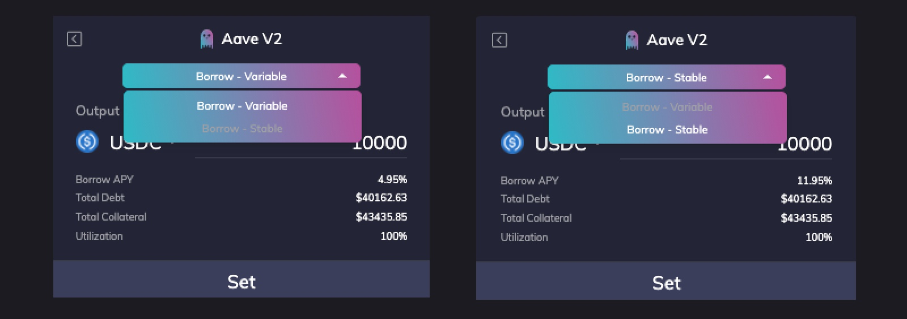
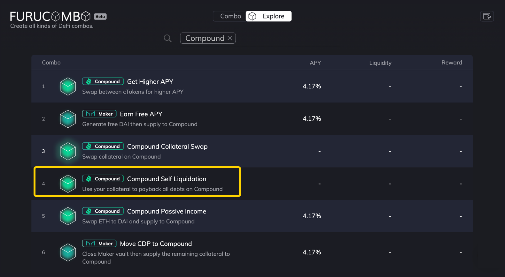
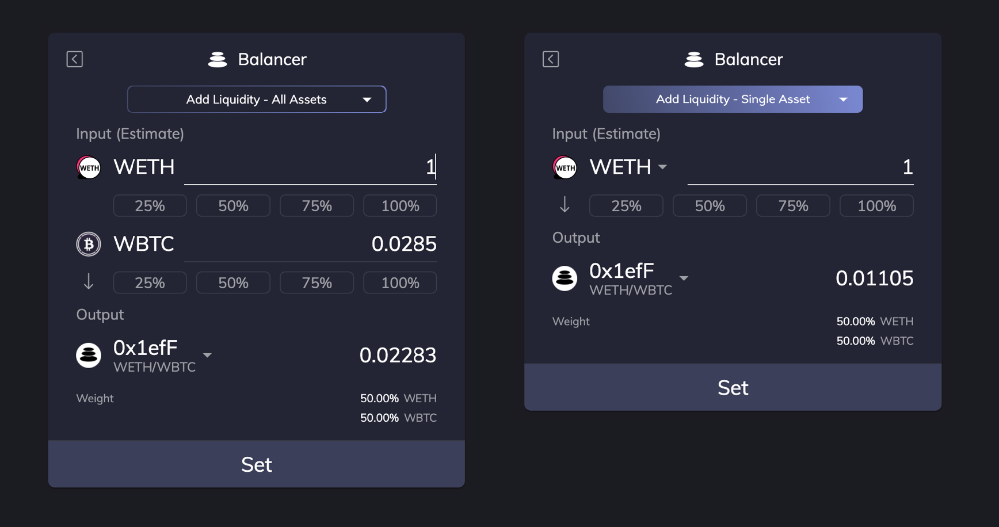
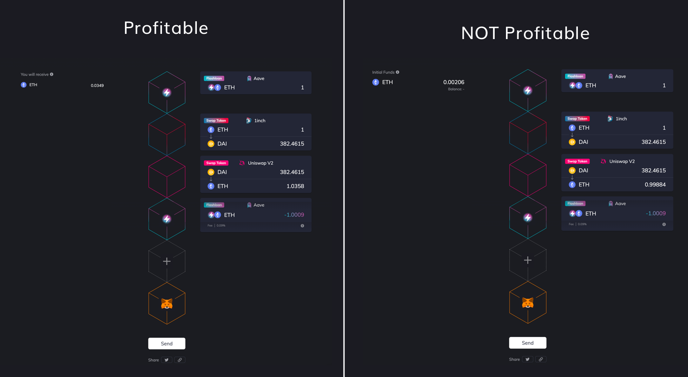
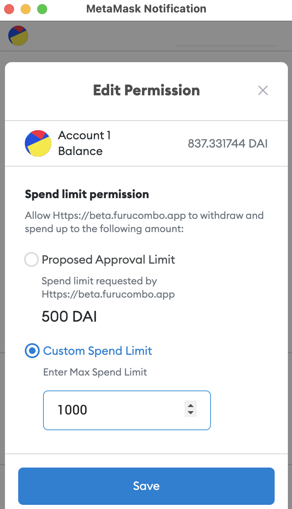

# Combo Page

## ● Synthetix cubes

### How do I stake on Synthetix?

We have a thorough tutorial guiding how to create a Synthetix Stake combo. [Read here](https://medium.com/furucombo/tutorial-synthetix-cubes-29dcc7a2fcdc)

### How do I unstake, claim, or see my rewards after using Synthetix Stake?

If you use Furucombo's Synthetix Stake Token cube, it will lead you to stake through Furucombo’s adapter contract. Hence, if you want to unstake, claim, or see rewards after the operation, you must use Furucombo as well.

## ● Uniswap V2 cubes

### I can't find the token/pool I want

We support import token feature on Uniswap V2 cubes. Simply paste the token address/pool token address onto the search bar. 

### Can I swap WETH directly?

Unfortunately, using WETH as input/output in Uniswap V2 cubes is not available on Furucombo. Alternatively, you can use WETH cube under the Utility to wrap/unwrap first. 

### What is the slippage set up on Uniswap?

The default slippage is set at 3%.

## ● Aave cubes

### How to use flashloan

We have a thorough tutorial guiding to create a flashloan combo. [Read here](https://medium.com/furucombo/create-flashloan-combo-on-furucombo-c7c3b23267f0) 

### Why does it say "something's wrong inside the flashloan cubes"?

When you hit send button, Furucombo runs an estimate of your combo in the sequence of your cubes setup. When you see the error message "something's wrong inside the flashloan", that means the transaction will fail when executing cubes inside the flashloan pair. 

The most common error is that the price has changed in the cubes inside the flashloan pair. Hit the refresh price button in this case. 

You may also try deleting the flashloan cubes and hit send again to see which cube comes in error. 

### Why do I have to pay 0.09% fee?

0.09% fee is paid directly to Aave for using flashloan. Furucombo does not charge any fee in any form.

### Why can't I put Aave cubes inside flashloan?

This is a limitation setup by Aave. When you use flashloan, you're taking the liquidity from Aave. It doesn't make sense to use the borrowed funds with the borrowed pool right?

### How do I borrow from Aave?

Before borrowing, you need to deposit first any asset which will be used as collateral on Aave. Then, you can use the Aave borrow cube to borrow funds. Select the asset you want to borrow and set the amount you need based on your available deposits used as collateral for the loan.

### **How do I repay my debt on Aave?**

You can simply use the Aave repay cube to repay your debt. Select the asset, set the amount to pay back, and confirm the transaction.

### **What are Borrow-Variable and Borrow-Stable options?**

Borrow-Variable is a rate based on the offer and demand in Aave. It'll change depending on market conditions.

Borrow-Stable is a fixed rate in the short-term but can be re-balanced in the long-term in response to changes in market conditions.

## ● Maker cubes

### What is a vault?

The Maker Vault is a core component of the Maker Protocol, which facilitates the generation of DAI against locked up collateral. All DAI in circulation are created by Vaults. Vault usage collectively alters the total supply of DAI. Users create DAI by generating it against their collateral and in-turn destroy DAI when repaying their generated DAI balance. 

Vaults are not free to use and come with inherent risks. Generating DAI requires the payment of Stability Fees \(SF\). The SF is a variable rate and is subject to change based on the decisions of MKR Token holders through voting. 

To reclaim collateral, users must repay the previously generated DAI and the accumulated SF.

Vaults are required to be overcollateralized and have a Liquidation Ratio that Vault owners need to uphold to avoid the Liquidation of their Vaults. When a Vault is liquidated, a Liquidation Penalty is applied, and collateral is sold to repay the Vault's outstanding DAI balance. Additionally, a Debt Ceiling is imposed globally on the Maker Protocol, as well as individually on each Vault type.

### Where do I get my vault number??

If you already have a vault, connect your wallet first and then choose any Maker cube except "New Vault". You will see your vault number displayed when you click the Vault \# blank.

If you use New Vault to create a vault. You will get the vault number after the combo is sent out successfully. Then you come back and choose any Maker cube except "New Vault" to see your vault number.

Alternatively, you can visit [oasis.app](https://oasis.app) to see your vault number.

### What is Oasis Trade?

Oasis Trade is launched by Maker. It is a liquidity pool on the Ethereum blockchain. The Simple Market and Matching Market smart contracts provide for the trustless atomic exchange of ERC20 tokens without third party counter-risk.

### How to profit from moving CDP to Compound?

This is a combo for users who already have a vault on Maker to help them easily move the tokens to Compound. It's not necessarily a profitable combo. More as an asset management combo for Maker 

## ● Curve cubes

### Can I choose the pool to swap?

You are not able to choose the pool on Curve. When you use Curve's Swap Token cube, Curve automatically choose the best pool for you. 

### What is the slippage set up on Curve?

The default slippage is set at 3%.

### My Claim CRV combo doesn't work

When you use Claim CRV, the claimed CRV token goes straight to your wallet. So, if you want to use the CRV tokens in the following cubes, you must insert an "Add Funds" cube as the next cube with CRV as inputs.

## ● 1inch cube

### I can't find the token I want, but I can find it on 1inch

Tokens on Furucombo are selected by Furucombo team. If you can't find the token you want, please let the team know on Discord \#feedback channel.

### What is the slippage set up on 1inch cube?

The default slippage is set at 3%.

### I use 1inch in my combo but it keeps saying it will fail

There's a known inconsitent issue for using 1inch. Here's a workaround solution for your reference:

* Go to 1inch.exchange to see  which swapping service they use in the route for your swapping pair. Say you see it goes through Uniswap V2
* Come back to Furucombo and replace 1inch cube with Uniswap V2

## ● Compound cubes

### How do I repay all debt on Compound?

Set a higher repay amount that exceeds debt and Furucombo will exactly repay all debt then return the rest of token to you.

### How can I self-liquidate on Compound?

We have a [pre-built combo](https://furucombo.app/combo/bt49ulfm1503gp5r5keg?refreshPrice=1) for you, which you can also find it on our [Explore Page](https://furucombo.app/explore/combo_compound_00004) for your future revisit. 

### What are Compound smart cubes? \(Smart Borrow/ Smart Repay/ Smart Collect\)

The smart cubes are advanced features on Furucombo and only users with a DSProxy smart wallet can use them. You can easily create a DSProxy smart wallet on Furucombo within 3 transactions, and you can skip 1 of them if you have ever created a vault on Maker or a smart wallet on DeFi Saver.

Once you create the smart wallet and create your Compound collateral-and-debt position, you would see a dashboard for the position in the wallet tab, and you could then use the Compound smart cubes to manage the position.

## ● Kyberswap cube

### I can't find the token I want, but I can find it on Kyberswap

Tokens on Furucombo are selected by Furucombo team. If you can't find the token you want, please let the team know on Discord \#feedback channel.

### What's the slippage setup on Kyberswap?

The default slippage is set at 3%.

## ● Balancer cubes

### I can't find the token/pool I want

Tokens on Furucombo are selected by Furucombo team. If you can't find the token you want, please let the team know on Discord \#feedback channel.

### How do I cross-examine the pool with Balancer?

1️⃣ Check the first six digits of the pool address.

2️⃣ Check the assets' weight in the pool

### What is Single-Asset and All-Assets options?

When adding/removing liquidity to/from Balancer, you will see options of All Assets and Single Asset at the top. Let's take the WETH 50%/WBTC 50% pool as an example:

* Add Liquidity - **All Assets**: You provide all the assets in the pool proportionally in the weights of the pool. 
  * 👉 You send 1 WETH and 0.0285WBTC to Balancer and you receive 0.02283BPT token.
* Add Liquidity - **Single Asset**: You only provide one type of token to the pool. Balancer will swap the token you provided proportionally to add liquidity into the pool.
  * 👉 You send 1 WETH to Balancer and you receive 0.01105BPT token.

## ● Mooniswap cubes

### I can't find the pool I want

Tokens on Furucombo are selected by Furucombo team. If you can't find the token you want, please let the team know on Discord \#feedback channel.

## ● Utility cubes

### What is Send Token?

As it says, Send Token cube lets you send token to your designated address. Some use case can be

* Send token to multiple addresses
* Send multiple tokens to one address
* Move all your dust tokens to another wallet

### What is WETH?

When you "wrap" ETH, you aren't really wrapping so much as trading via a smart contract for an equal token called WETH. If you want to get plain ETH back you need to "unwrap" it. AKA trade it back for plain ETH.

To learn more about WETH, visit[ weth.io](https://weth.io/)

### What is Add Funds?

Add Funds cube is used when you need to send ETH or tokens to Furucombo **during the execution** of a combo. 

For example, when you wanna claim your CRV and sell them to DAI, you must use "Add Funds" to complete the combo. This is because when you claim CRV, the claimed CRV tokens go straight to your wallet but not Furucombo. In order to continue sending those CRV to Uniswap, you need to send the CRV to Furucombo first. See the correct setup below.

### What is Return Funds?

Return Funds cube is used when you want to send ETH or tokens back to your wallet **during the execution** of the combo. Although Furucombo sends all the funds back to users upon completing the execution of the combo, in some cases, Return Funds must be added to successfully execute the combo. 

For example \(see below image\), you want to swap your collaterals on Compound, say cDAI to cETH. When you borrow ETH from flashloan and supply the ETH to Compound, the cETH you see in the second cube is actually sent to Furucombo's proxy. Your cDAI are locked until you have enough cETH supporting your debt, so here we need "Return Funds" cube which transfers cETH from Furucombo's proxy to your wallet. And in the next cube, you move your cDAI to Furucombo's proxy by "Add Funds" cube!

### What is Gas Saver?

Gas Saver cube is used when you have some CHI or GST2 tokens in your wallet. When you burn them \(esp at a high gas price\), you get a refund to make the gas cost much cheaper to execute than the same transaction that doesn't use GasToken. To learn more about gas token, check out the links below:

* [GasToken.io](https://gastoken.io/#:~:text=GasToken%20is%20a%20new%2C%20cutting,gas%20when%20it%20is%20expensive.)
* [CHI token by 1inch ](https://medium.com/@1inch.exchange/everything-you-wanted-to-know-about-chi-gastoken-a1ba0ea55bf3)

## 🧠 Arbitrage strategies

### What is arbitrage?

In many ways, crypto arbitrage is just like fiat or sports arbitrage. The main idea here is simple: you try to benefit from price differences for the same asset on different markets or exchanges. 

Investopedia describes arbitrage as “the simultaneous purchase and sale of an asset to profit from an imbalance in the price. It is a trade that profits by exploiting the price differences of identical or similar financial instruments on different markets or in different forms.”

In other words, **buy low and sell high**! 

Related reads: 

* [Arbitrage in DeFi by The Block](https://www.theblockcrypto.com/post/45750/exploring-defi-trading-strategies-arbitrage-in-defi)

### What does a profitable combo look like?

* There is **no** initial funds


If you see initial funds section appears, that means this is not a profitable combo. The worst case is that you lose the initial funds and get nothing back. 


* You will receive
  * Assets shown in this section are profits from the combo.

### How to make a profitable combo?

* First and foremost, you need to find an arbitrage opportunity. 
* Taking gas costs into consideration, arbitrage combos cost more than average combos due to the complexity of the actions. This is a primary cost factor influencing the profitability of the trade.
* Remember there are many bots front-running trades at all times. So there's a chance that your combo may be front-ran by bots.
* Arbitrage combos have a higher chance to fail as the combo setup usually has a high dependency on each cubes' outputs. That being said, once the opportunity vanishes, your combo fails and you lose the gas fee you just pay. 

## 👛 Wallet

### I don't see Coinbase wallet in the menu

If you don't see Coinbase Wallet, click Wallet Connect and scan the QR code with your Coinbase Wallet app.

### Can I use MetaMask on Brave?

Follow [this tutorial](https://www.loom.com/share/bee83b1e0d724779aa4d22c9d8a242c0) to let Furucombo connect your MetaMask on Brave.

The reason behind this is because Brave just update their setting on how to connect "Web3 provider for using Dapps".  
​  
We will keep investigating this issue and make sure it is up to date.

### I can not connect to the platform

* Make sure to select the correct network \(Ethereum Mainnet\), normally on the wallet provider you can switch the network on the settings options.
* On Ledger natively or over Metamask:
  * Make sure to unlock and select Ethereum app.
  * Make sure Contract data is allowed on the Ethereum app settings.
* Coinbase
  * Use the scan QR code to connect.
* Wallet connect
  * Use the scan QR code to connect
* Fortmatic
  * Make sure to switch to Ethereum Mainnet.

## ⛽️ Gas

### Why is the gas fee so high?

It depends on how many cubes you use and how busy the Ethereum network is. You can click “Send” button to estimate the gas cost. Your wallet \(e.g. MetaMask\) will pop up and tell you how much you may spend on the gas fee.

### Can I know how much gas before send?

Unfortunately, you are not able to get the estimate of gas before hitting the send button.

### How can I set up the gas price?

You can adjust gas price and gas limit when using MetaMask wallet. Upon hitting the send button, you'll see a MetaMask pop-up. Click "EDIT" then you will see choices of speed. 

To customize the transaction fee, select Advanced Options:

You can manually enter Gas Price \(GWEI\) and Gas Limit.  You can also click on the Live Gas Predictions graph.

### Should I reduce gas limit?

No, you shouldn't. The gas limit is the budget of the transaction. The unused gas will be refunded to your wallet. However, if the gas costs more than your gas limit, everything will be reverted but the gas will NOT be returned.

## 📖 Other FAQs

### How do I adjust initial funds?

The amount of initial funds is auto-updated.

You just need to adjust the numbers in the cubes, then the required amount of initial fund would be updated accordingly.

### Why do I need to sign two times?

Normally you need to send 2 transactions to process a non-ETH token transfer.  
For example, If you want to swap DAI to COMP, you have to sign twice on your wallet:

1. Approve: to grant Furucombo the permission to move your tokens.
2. Send: to execute your transaction. In this example, to swap your DAI to COMP.

### How many times do I have to approve?

It depends on what tokens you have and what cubes you are going to use.

The number of times you need to approve is based on how many conditions below are met, and how much the amount of approved ERC-20 tokens that you grant Furucombo to move.

* First time to use ERC20 tokens as initial funds
* First time to use any of the below cubes:
  * Maker withdraw
  * Maker Generate
  * Curve Stake
  * Curve Claim

Amount of the approved ERC-20 token:

* For safety considerations, the default ERC-20 token amount of approval will be precisely the amount spent on Furucombo.
* You can custom a higher token amount of approval as well. By doing so, before the amount of token approval limit running out, you don't need to send out other approval transactions of the token.
  * MetaMask - when approving Furucombo to spend your tokens, you can click "Edit Permission" to custom a higher spend limit. 
  * Please note that the transaction will fail if you adjust it to a fewer approval limit.

Examples:

* First-time user Alice's combo: Swap ETH to DAI
  * No need to approve \(ETH is not an ERC-20 token\)
* First-time user Bob's combo: Swap $500 DAI to ETH
  * Need to approve once for DAI
  * And he adjusts the DAI's Spend Limit on Furucombo to $1000.
* Bob's 2nd combo: Swap $200 DAI to COMBO
  * No need to approve \(Because he still has the rest $500 amount of DAI approval limit.\)
* Bob's 3rd combo: Deposit WBTC to Maker and Generate DAI
  * Need to approve twice \(Once for WBTC, Once for Maker Generate\)

### Why does it keep saying my transaction will fail?

In most cases, it's because the price has changed and you need to update the numbers.

If you use flash loan cubes and see the error message, it means that you need to update the numbers of the cubes within the flash loan pair.

### Why did my transaction fail?

In most cases, it's because the price changed which making your combo too far from your original set. You can avoid this kind of failure by leaving more room for slippage:

For example, you want to swap 1 ETH to DAI, then add DAI to Curve pool as a Liquidity Provider \(LP\): 

Good combo:

* Cube 1: swap 1 ETH to 400 DAI
* Cube 2: add 380 DAI to Curve pool

Bad combo:  

* Cube 1: swap 1 ETH to 400 DAI 
* Cube 2: add 400 DAI to Curve pool

When you enter 400DAI in Cube 2, your transaction will fail once the swapping result in Cube 1 gives you less than 400DAI, which is not uncommon. Leaving a difference in the 2nd cube input can increase the chance of success significantly. In the "Good combo" example, the transaction would only fail when ETH price drops below $380 \(&gt; 5%\)  between the time you set the combo and send it out.  
  
Using Chained input feature to avoid slippage: 

* Chained input feature - enabling cubes to auto-capture the previous one's on-chained result to optimize the trading efficiency. With just one click of a "Prev Output" button, you can use 100% entirely swapped amount in a cube to interact instantaneously with your following trading actions.

### Why can't I send even I know it will fail?

It's a mechanism to prevent you from losing money easily.

### How do I cancel my pending transaction?

You can use the "cancel" button in-app if you are using MetaMask or Trust. For other wallets, you can check their official websites for more details. Alternatively, you can also send another transaction with the same wallet and **same** **nonce** with a higher gas price. 

### My transaction is stuck pending confirmation

In this situation make sure to not keep sending transactions. Every new transaction will be stuck pending until the oldest transaction is confirmed. You can get rid of the stuck transaction by speeding it up or canceling it, depending on if the wallet you are using you has natively that option. For example, Metamask or Trust wallet have both the options to cancel or speed up transactions. 

Alternatively, if your wallet provider doesn't have a speed-up or cancel option, you can still drop the stuck transaction by sending a 0 ETH transaction to your address \(to yourself\) using the same nonce \(number id\). You can inspect the nonce in your transaction on [Etherscan ](https://etherscan.io)and use services like [MEW ](https://www.myetherwallet.com/)and [MyCrypto ](https://mycrypto.com/)to send this transaction with higher gas cost and replace the stuck one. 

### I can not press the send button

Try to reconnect your wallet.

### I don't know what to build, is there any example combo

Visit [Explore Page](https://furucombo.app/explore) to get some inspirations. 

### How do I save my combo?

When you set up a combo, click the chain icon underneath the send button. Thank you'll get a link to the current combo.

### How do I share my combo?

When you set up a combo, there will be a “share” link at the bottom, click the chain icon to get the link or click the Twitter icon to share it on Twitter.

### I refresh price and it still says it will fail

In most cases, it's because the price changed again and you need to update the numbers.

Furthermore, if you are using 1inch cube and see this error message several times, try to use another swapping cube to get a more stable quotation. 

### The site does not load

The following steps may solve your problems:

* If you use Brave browser, switch to another browser to discard the issues from the browser. If it is related with Brave browser, some actions to take that may help are:
  * Clearing cache data and cookies for the site
  * Hard refresh with control + F5 \(or cmd + r\)
  * Disable brave wallet \(or the not default wallet been used, for example, metamask, dapper etc\)
  * Or other extensions that might be interfering with proper connection with the wallet
  * If after trying all the above steps, it still keeps failing. Unfortunately, we suggest you access Furucombo using other browser as those incompatibilities come from Brave browser.
* Make sure your internet connection is working and is stable
* Restart the browser and try to connect again
* Try to hard refresh the site with control + F5
* Check if there is any update for your browser or wallet provider used, if so, update it to the latest version.

### 

