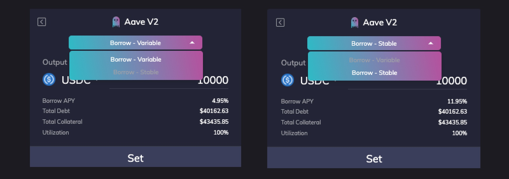

# DeFi Cube FAQ

## ● Uniswap V2 cubes

### I can't find the token/pool I want

We support import token feature on Uniswap V2 cubes. Simply paste the token address/pool token address onto the search bar.&#x20;

.png>)

### Can I swap WETH directly?

Unfortunately, using WETH as input/output in Uniswap V2 cubes is not available on Furucombo. Alternatively, you can use WETH cube under the Utility to wrap/unwrap first.&#x20;

### What is the slippage set up on Uniswap?

The default slippage is set at 3%.

## ● Aave cubes

### How to use flashloan

We have a thorough tutorial guiding to create a flashloan combo. [Read here](https://medium.com/furucombo/create-flashloan-combo-on-furucombo-c7c3b23267f0)&#x20;

### Why does it say "something's wrong inside the flashloan cubes"?

When you hit send button, Furucombo runs an estimate of your combo in the sequence of your cubes setup. When you see the error message "something's wrong inside the flashloan", that means the transaction will fail when executing cubes inside the flashloan pair.&#x20;

The most common error is that the price has changed in the cubes inside the flashloan pair. Hit the refresh price button in this case.&#x20;

You may also try deleting the flashloan cubes and hit send again to see which cube comes in error.&#x20;

### Why do I have to pay 0.09% fee?

0.09% fee is paid directly to Aave for using flashloan. Furucombo does not charge any fee in any form.

### Why can't I put Aave cubes inside flashloan?

This is a limitation setup by Aave. When you use flashloan, you're taking the liquidity from Aave. It doesn't make sense to use the borrowed funds with the borrowed pool right?

### How do I borrow from Aave?

Before borrowing, you need to deposit first any asset which will be used as collateral on Aave. Then, you can use the Aave borrow cube to borrow funds. Select the asset you want to borrow and set the amount you need based on your available deposits used as collateral for the loan.

### **How do I repay my debt on Aave?**

You can simply use the Aave repay cube to repay your debt. Select the asset, set the amount to pay back, and confirm the transaction.

### **What are Borrow-Variable and Borrow-Stable options?**

Borrow-Variable is a rate based on the offer and demand in Aave. It'll change depending on market conditions.

Borrow-Stable is a fixed rate in the short-term but can be re-balanced in the long-term in response to changes in market conditions.

## ● Maker cubes

### What is a vault?

The Maker Vault is a core component of the Maker Protocol, which facilitates the generation of DAI against locked up collateral. All DAI in circulation are created by Vaults. Vault usage collectively alters the total supply of DAI. Users create DAI by generating it against their collateral and in-turn destroy DAI when repaying their generated DAI balance.&#x20;

Vaults are not free to use and come with inherent risks. Generating DAI requires the payment of Stability Fees (SF). The SF is a variable rate and is subject to change based on the decisions of MKR Token holders through voting.&#x20;

To reclaim collateral, users must repay the previously generated DAI and the accumulated SF.

Vaults are required to be overcollateralized and have a Liquidation Ratio that Vault owners need to uphold to avoid the Liquidation of their Vaults. When a Vault is liquidated, a Liquidation Penalty is applied, and collateral is sold to repay the Vault's outstanding DAI balance. Additionally, a Debt Ceiling is imposed globally on the Maker Protocol, as well as individually on each Vault type.

### Where do I get my vault number??

If you already have a vault, connect your wallet first and then choose any Maker cube except "New Vault". You will see your vault number displayed when you click the Vault # blank.

If you use New Vault to create a vault. You will get the vault number after the combo is sent out successfully. Then you come back and choose any Maker cube except "New Vault" to see your vault number.

.png>)

Alternatively, you can visit [oasis.app](https://oasis.app) to see your vault number.

### How to profit from moving CDP to Compound?

This is a combo for users who already have a vault on Maker to help them easily move the tokens to Compound. It's not necessarily a profitable combo. More as an asset management combo for Maker.&#x20;

## ● Curve cubes

### Can I choose the pool to swap?

You are not able to choose the pool on Curve. When you use Curve's Swap Token cube, Curve automatically choose the best pool for you.&#x20;

### What is the slippage set up on Curve?

The default slippage is set at 3%.

### My Claim CRV combo doesn't work

When you use Claim CRV, the claimed CRV token goes straight to your wallet. So, if you want to use the CRV tokens in the following cubes, you must insert an "Add Funds" cube as the next cube with CRV as inputs.

## ● 1inch cube

### I can't find the token I want, but I can find it on 1inch

Tokens on Furucombo are selected by Furucombo team. If you can't find the token you want, please let the team know on Discord #feedback channel.

### What is the slippage set up on 1inch cube?

The default slippage is set at 3%.

### I use 1inch in my combo but it keeps saying it will fail

There's a known inconsitent issue for using 1inch. Here's a workaround solution for your reference:

* Go to 1inch.exchange to see  which swapping service they use in the route for your swapping pair. Say you see it goes through Uniswap V2
* Come back to Furucombo and replace 1inch cube with Uniswap V2

## ● Compound cubes

### How do I repay all debt on Compound?

Set a higher repay amount that exceeds debt and Furucombo will exactly repay all debt then return the rest of token to you.

### How can I self-liquidate on Compound?

We have a [pre-built combo](https://furucombo.app/combo/bt49ulfm1503gp5r5keg?refreshPrice=1) for you, which you can also find it on our [Explore Page](https://furucombo.app/explore/combo\_compound\_00004) for your future revisit.&#x20;

### What are Compound smart cubes? (Smart Borrow/ Smart Repay/ Smart Collect)

The smart cubes are advanced features on Furucombo and only users with a DSProxy smart wallet can use them. You can easily create a DSProxy smart wallet on Furucombo within 3 transactions, and you can skip 1 of them if you have ever created a vault on Maker or a smart wallet on DeFi Saver.

Once you create the smart wallet and create your Compound collateral-and-debt position, you would see a dashboard for the position in the wallet tab, and you could then use the Compound smart cubes to manage the position.

## ● Kyberswap cube

We don't support the latest version of Kyber at the moment.

## ● Balancer cubes

We don't support the latest version of Balancer at the moment.

## ● B.Protocol cubes

[B.Protocol](https://app.bprotocol.org/app) is a backstop liquidity protocol built on top of DeFi lending platforms. Currently, Furucombo supports B.Protocol integration with Maker, and we will later expand to Compound and Aave.

### Where do I get my vault number??

If you already have a vault, connect your wallet first and then choose any B.Protocol cube except "New Vault". You will see your vault number displayed when you click the Vault # blank.

If you use New Vault to create a vault. You will get the vault number after the combo is sent out successfully. Then you come back and choose any B.Protocol cube except "New Vault" to see your vault number.

## ● Synthetix cubes

### How do I stake on Synthetix?

We have a thorough tutorial guiding how to create a Synthetix Stake combo. [Read here](https://medium.com/furucombo/tutorial-synthetix-cubes-29dcc7a2fcdc)

### How do I unstake, claim, or see my rewards after using Synthetix Stake?

If you use Furucombo's Synthetix Stake Token cube, it will lead you to stake through Furucombo’s adapter contract. Hence, if you want to unstake, claim, or see rewards after the operation, you must use Furucombo as well.
