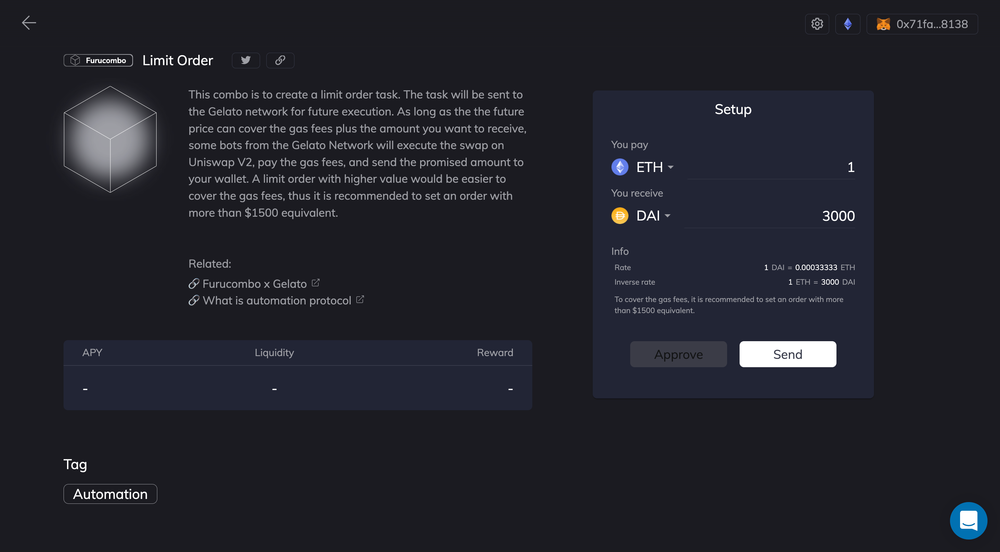
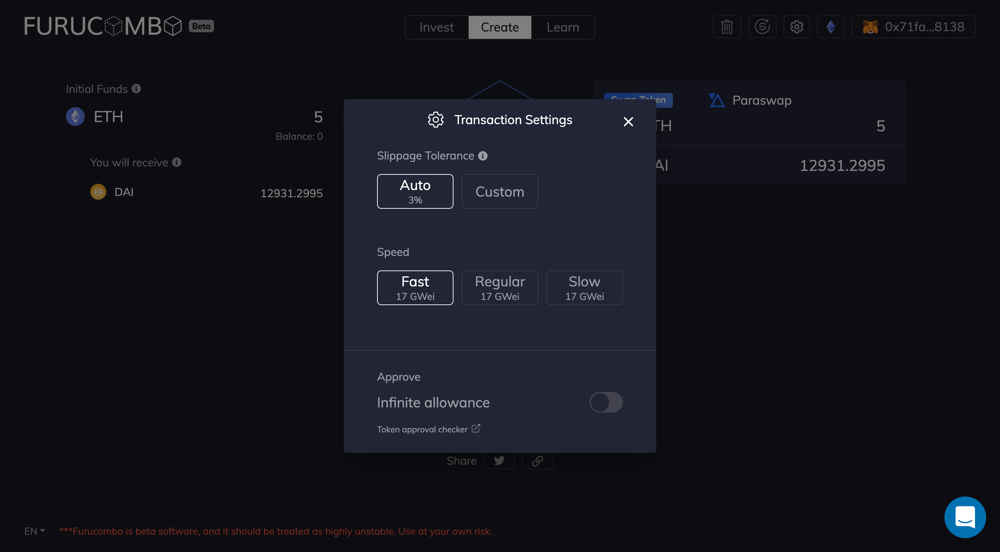

# What is slippage

Slippage happens when a trader makes a trade, and the price is higher or lower than expected (for both buying and selling).

Let's get started!

### Slippage can either be positive or negative.

📈 A positive slippage occurs when an order is executed at a more favourable price than the intended execution price.

📉 Conversely, if a trader received a less favourable price than intended, it is considered negative slippage.

### What causes slippage?

Two primary reasons tend to cause slippage: Volatility & Liquidity.

Volatility: After sending out a txn, it takes time for the transaction to make it on-chain. Hence, the final price might differ from the price which was expected.

Liquidity: liquidity refers to the ease with which an asset can be traded to another without affecting its market price. The lower an asset's liquidity is, the higher risk a trade will be affected, and vice versa.

### &#x20;**How to reduce the effects of slippage?**

#### 1️⃣ Trading only in highly liquid markets:

Highly liquid markets have more stable liquidity on both asset sides which increases the likelihood of an order being executed at the requested price.

#### 2️⃣ Avoid trading while the market is volatile:&#x20;

Try to not FOMO when the price swings violently to avoid suffering from the negative slippage.

#### 3️⃣ Use the limit order feature

A limit order will only be executed at your desired price, eliminating the risk of negative slippage which can occur.\
\
Use a limit order combo, powered by [Gelato network](https://www.gelato.network): [https://furucombo.app/explore/combo\_furucombo\_00003](https://furucombo.app/explore/combo\_furucombo\_00003).

#### **4️⃣ Slippage Tolerance:**&#x20;

You can set your own slippage tolerance when trading on [Furucombo](https://furucombo.app). Your txn will revert if the price change unfavourably by more than the percentage you set. However, note that if you set the slippage tolerance too low, your txn might not be able to execute and will fail.

