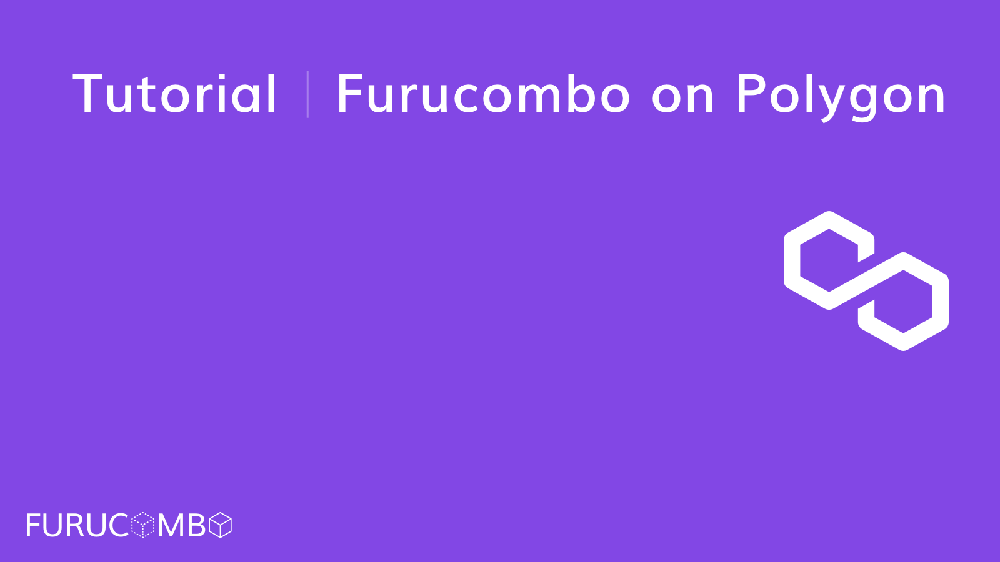
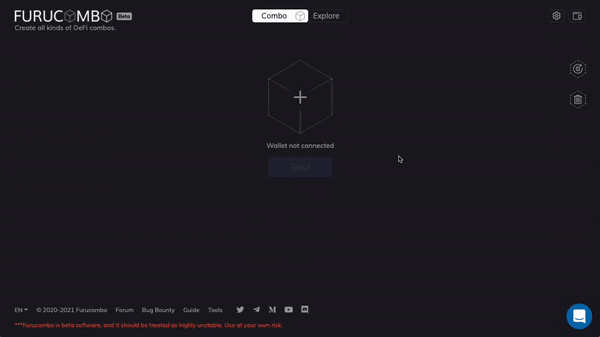
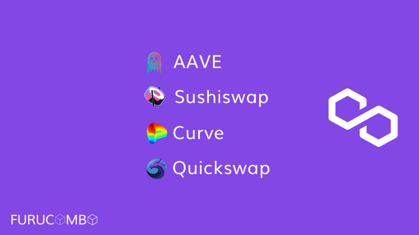
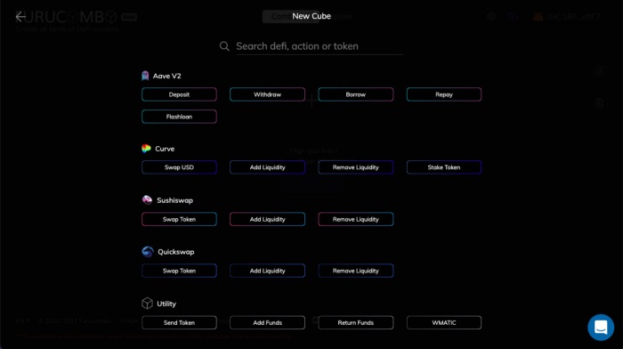
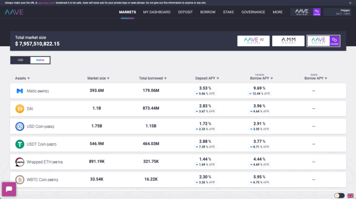

# Furucombo on Polygon

Polygon is a well-structured development framework for building and connecting Ethereum-compatible blockchain networks. In the last six months, the total value locked on Polygon has reached $6 billion. We have seen tremendous demand to manage portfolios with Furucombo on Polygon, as many Ethereum Dapps including Aave and Sushiswap have expanded to the network.

In this article, we will cover all your frequently asked questions and share a range of figures to give our community a better view of gas and transaction fee advantages of using Polygon.

## We will cover 

* How to access Furucombo on Polygon
* How to move tokens from Ethereum to Polygon
* What cubes we have on Furucombo x Polygon
* I have WETH, but I want to lend MATIC on Aave, how? What about fees?

### How to access Furucombo on Polygon 

1. Connect your MetaMask wallet
2. Click the network switch button and select Polygon
3. Switch the network on your Metamask wallet

Currently, we only support MetaMask wallets on Chrome to access Furucombo on Polygon, and please note that you will not be able to send transactions if your MetaMask wallet is linked with a hardware wallet.

### How to move tokens from Ethereum to Polygon 

We will soon release a native token bridge on Furucombo, but right now we recommend using the Matic Bridge to convert the assets in the wallet between Ethereum and Polygon \(Matic\) network.

1. Connect your MetaMask wallet on [Matic Bridge](https://wallet.matic.network/bridge/)
2. Input the amount you’d like to move, and click “Transfer” and “Continue”
3. Once you send out the transaction, you will see the balance updated in around 10 minutes. This means that your tokens have been successfully transferred to the same wallet address under the Polygon network.
4. In a few minutes after, you should receive some extra MATIC tokens as provided by the Polygon team to support your gas fees on Polygon for a few transactions.



For your reference, at the time of writing it costs around US$2.27 \(11 gwei\) in ETH to complete the transaction.

### What cubes do we have on Furucombo x Polygon 

Once you have tokens in your wallet on Polygon, you can then start to explore the DeFi legos that Furucombo supports.

We have supported 19 cubes since the launch on Polygon. With cubes from Aave, Curve, Sushiswap, and Quickswap, users can now complete the below strategy with ease:

**Simple:**

* Lend or borrow tokens on Aave
* Swap tokens on Curve, Quickswap, or Sushiswap
* Add liquidity to Curve, Quickswap, or Sushiswap

#### **Advanced:**

* Aave collateral swap with flashloan
* Aave collateral and debt position leveraged with flashloan
* Aave debt swap with flashloan
* DEX arbitrage with Curve, Sushiswap, and Quickswap

#### **More combo hack?**

* We will share more interesting strategies on Twitter with the[ \#combochallenge](https://twitter.com/hashtag/combochallenge?src=hashtag_click) tag!

### **I have WETH on Polygon, but I want to lend MATIC on Aave. How can I do this? And what about fees?**

1. Make a 2 cubes combo with a swap cube and a deposit cube.
2. Click the “Approve” button to grant Furucombo access to move your WETH tokens.
3. Click the “Send” button to actually convert your WETH to MATIC and deposit to Aave simultaneously.

For your reference, it costs around US$0.001 \(1 gwei\) to complete the transaction on Polygon on the day of writing. __While it costs about US$1.1 \(12 gwei\) on Ethereum to complete a similar transaction. That is 1000+ times less using Polygon!

What other advantages?

On top of the fact that the gas fees are significantly lower on Polygon compared to Ethereum, Polygon now offers many incentives to encourage new users onboard. For example, Polygon provides extra MATIC bonuses to Aave lenders and borrowers. So are the liquidity providers on Curve, Quickswap, and Sushiswap!

Let’s hop on the Polygon train and explore Furucombo in a near gas-less world!

