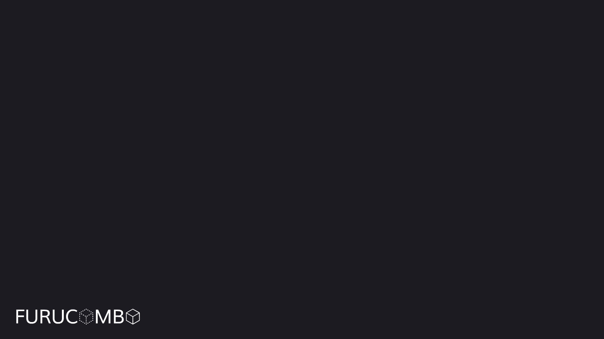

# Invest Page

Furucombo Invest is a strategy hub that organizes investment opportunities in the DeFi space, and allows you to invest in popular platforms across the ecosystem. It is a very easy to use intuitive platform which allows even the most basic users to reap the benefits of farming and decentralized finance.   
  
This is accomplished by our 1 button staking system which allows users to swap their single token directly into the farming contract. Users will no longer have to calculate how much liquidity must be provided for each pooled token, swap half of their tokens to balance the LP, add to the LP, and then add their LP to the farming contract. All this will be done automatically with Furucombo Invest.

Furucombo Invest also allows users to auto-compound their rewards with our Auto-Farming pools. This means any reward tokens from farming will be automatically compounded to earn even higher APY from the compounded effects. This is a very strong mechanism to grow your funds and earn the highest rewards.   
  
Additionally, Furucombo’s staking contract Trevi allows for multiple reward tokens to be earned. There is a 20% performance fee on the compounded rewards which will go back to the treasury for use via the Combo holders through governance once implemented. This is only applied to the Auto-Invest Farms by Furucombo. There is however no other fees for using the platform, no deposit or withdraw fees.

