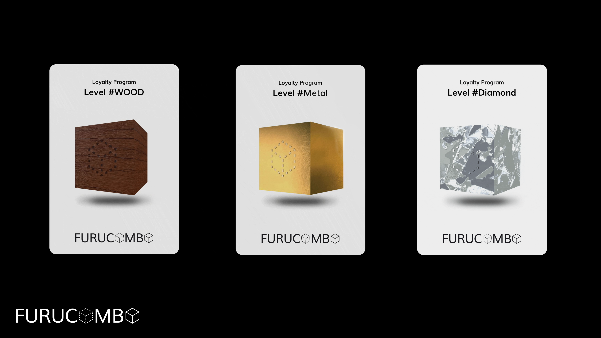

# Loyalty Program

Launching very soon will be our 3rd iteration of our NFT program \(you can read more about our Lotto NFT & Milestone NFT programs by clicking [this link](https://medium.com/furucombo/furucombo-invest-lotto-ticket-milestone-nft-campaigns-64733dd896c3)\). This is the biggest and most important part of growing a strong community — our Loyalty program!

The Furucombo loyalty program will give members of our community a chance to alchemize points, which can be used to transmute into different cubes to earn special features.

## How to Earn Points 

Currently, there are two ways to earn points. Users can stake to Furucombo’s Auto-Invest Pools on the Polygon network, and users can perform unique cube transactions on Ethereum to earn points.

## Point Calculation 

### For Polygon: 

* Every $1000 staked in an Auto-Invest Pool will earn 5 points per day \(up to $10k\)
* Every $1000 after 10k will earn 2.5 points per day up to $25k
* Every $1000 after 25k will earn 1.25 points per day up to $50k
* Every $1000 after 50k will earn 0.5 points per day up to $100k
* Every $1000 after 100k will earn 0.25 points per day up to $250k

### For Ethereum: 

Each unique cube will earn 10 points per day

## Points Interface 

You can check your accumulated points on the wallet tab on Furucombo. Points will be updated by the Furucombo team once a day.

## Transmute Points into Cubes 

Once you have collected enough points, you will be able to transmute them into unique cubes with special effects. Cubes can currently only be transmuted on the Ethereum blockchain.

Once live, to transmute your points into a cube, visit our campaign page on Galaxy Ecosystem. There you will be able to perform a transaction to burn your points to transmute a cube. Once transmuted, the cube will also be upgradable from wood to metal and then to diamond.

Note that points & NFTs are updated daily so they may not immediately reflect in your wallet UI. Each cube has its own unique benefits.

### Transmutation: 

**1. Wooden Cube**

* Requires 1500 points to transmute a wooden cube

**2. Metal Cube**

* To be announced

**3. Diamond Cube**

* To be announced

## Cube Benefits 

Each style of cube has its own unique benefits. Some effects are passive, meaning you will receive the benefit simply by holding the NFT in your wallet, and some are active, meaning you have to perform a task to receive the benefit \(such as gas reimbursement\). When in possession of the cube, you will receive the following:

**1. Wooden Cube**

* Each wooden cube NFT grants a 1.1x multiplier on points generated
* This is capped at 2x \(or a maximum of 10 wooden cubes\)
* Passive effect \(bonus will apply automatically\)

**2. Metal Cube**

* To be announced

**3. Diamond Cube**

* To be announced

## Pizza Slice NFTs 

Users that have Pizza Slice NFTs from the previous season’s liquidity mining can send them to our ‘fridge’ to upgrade the old NFTs to generate points. Additionally, if a user sends all 12 slices, they will receive a 50% reduction in fees for life on the Furucombo platform. This is a very special bonus for only the most dedicated community members and we appreciate the continued support. To add your NFT’s in the ‘fridge’ contact the Furucombo team on discord.


_Furucombo reserves the right to change the details of the program at any time._


