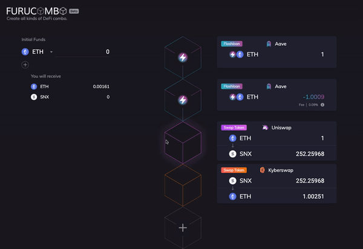

# Beginner’s Guide


Welcome to Furucombo. In this guide, we’ll walk through all the basics you need to know to successfully create a combo. Before we begin, let’s talk about “what is Furucombo?”.

Furucombo is a tool built for end-users to optimize their DeFi strategy simply by drag and drop. Just like building your own DeFi legos, but you don’t need to know how to code. It visualizes complex DeFi protocols into cubes. Users just need to enter inputs/outputs and set up orders of the cubes \(we call this a “combo”\), then Furucombo will package all the cubes into one transaction and send out. This is a great tool for people who want to perform actions across different protocols, especially those who want to leverage flashloan. \(We cover flashloan in the article [here](https://medium.com/furucombo/create-flashloan-combo-on-furucombo-c7c3b23267f0).\)

Now you get the idea of what Furucombo is, let’s get started!

## Furucombo Interface Guide <a id="229e"></a>

### ・DeFi Menu <a id="e7c5"></a>


To start creating a combo, first, you’ll need to select a DeFi protocol. Click the “＋” cube then a menu of DeFi protocols will pop up. Here you can choose which DeFi protocol you want to put in your combo. Each button represents a cube to be set up. Each cube means an action to be executed. The search feature at the top lets you search by defi name, defi action \(e.g. swap, add liquidity, etc\) or name of the token that is supported under certain defi.

### ・Initial Funds <a id="1bcf"></a>


When you start setting up cubes, you may see a section at the top left called “Initial Funds”. It means the funds that you must provide at the beginning of the combo to initiate the transaction.

Initial funds are sent directly _**from your wallet.**_ That been said, you must have enough balance of the token\(s\) in your wallet otherwise the transaction will _**NOT**_ be executed. When your wallet is connected, the wallet balance of each token will be displayed here so you can always check before sending out the combo.

### ・You will receive <a id="5cd0"></a>


On the left, you see a “_**You will receive**_” section. These are the funds to be returned back to your wallet at the end of the transaction. It is the result of all the inputs and outputs you’ve built on the right, which are updated every time you make a change of a cube.

```text
👩🏻‍🏫 Just think that 
“Initial Funds” is how much you put and, 
"You will receive" is how much you get at the end.
```

## Step by step <a id="2fb4"></a>

### Step 1: Setting up cubes ⚙️ <a id="0903"></a>


When you select a protocol, you’re led to enter the details of the cube. Here you will frequently see the terms “Input” & “Output”.

```text
Input means how much token you'll spend upon executing this action.
Output means how much token you'll receive upon executing this action.
```

Source of input can be tokens you have in your wallet or it can be outputs of previous cubes. Once you set up the cube, you can always edit/delete it by clicking the pen/trashcan icon at the top right of each set.

### Step 2: Drag and drop 🖱 ✋🏻 📦 <a id="5853"></a>



All cubes you set up are draggable. Simply _**drag**_ them in the order you wish. When the combo is sent, actions are executed according to the order of the cubes.

> Example: When you create flashloan, you’ll see a pair of two cubes appear. \(1st cube means “borrow” and 2nd cube means “payback”.\) The next thing you need to do is adding more cubes \(actions you wanna do with the borrowed tokens\) and **drag** them between the flashloan pair.

### Step 3: Connect Your Wallet 👛 <a id="f5ac"></a>


You can create a combo without connecting to your wallet. But if you want to send out the combo, you must connect your wallet. Simply click the cube with a wallet icon. Then choose your wallet to connect.

### Step 4: Sending Out a Combo 🔗 🎉 🎁 <a id="bafb"></a>


The complete flow of sending out a combo would be:

1️⃣ Click “_**Approve**_” when your initial funds are ERC20 tokens. You only need to do this once per token.

2️⃣ Click “_**Send**_”, then Furucombo will run an estimate of your combo. If the transaction will fail, a message will pop out as a reminder so you can modify your combo. Conversely, you will see a request pop-up on your wallet to sign the transaction.

3️⃣ Once your combo is sent out successfully, the button changes to “_**New Combo**_” and a message with the transaction link pops up. When you see these changes, congrats!

You’ve completed a combo! Don’t forget to share your result on Twitter simply by clicking the Twitter icon.

We’ve also made a video tutorial of this guide. Check it out 👇🏻



##  <a id="c2c7"></a>

