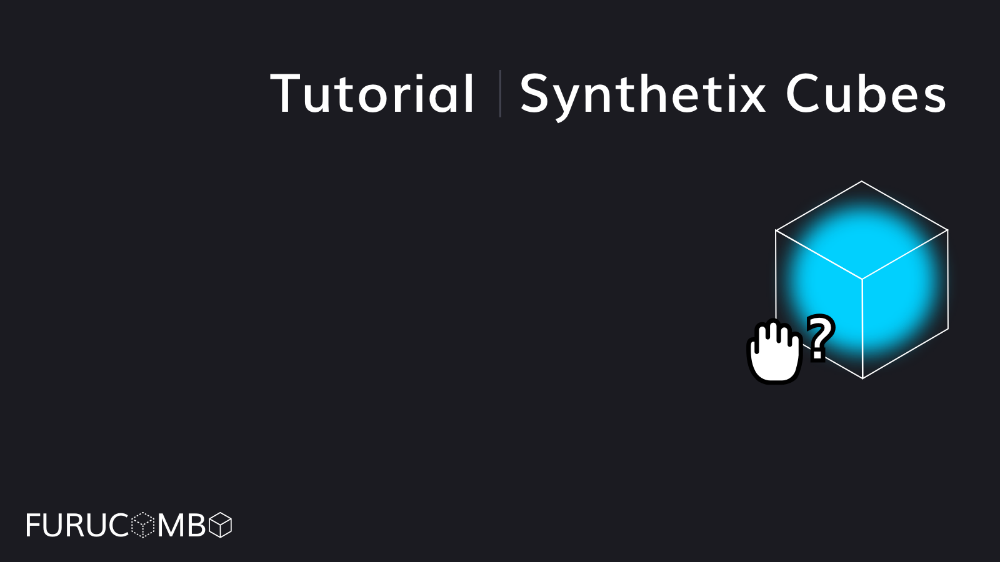

# Synthetix Cubes

## How to stake your Curve LP tokens to Synthetix?

Synthetix provides weekly SNX rewards to several staking pools, including the incentives for the Curve sUSD and sEUR liquidity providers. With the phased rollout of the Synthetix integration, you can now stake your Curve LP tokens to Synthetix, and claim the rewards on Furucombo directly!

This integration represents a major step for building yield farming cubes on Furucombo. Previously Furucombo couldn’t support most staking activities because the farming protocols would see only one staker, the Furucombo proxy contract, instead of the many individual stakers using Furucombo. We have tackled the challenge with our Synthetix adaptor, and the related smart contracts have been audited by Haechi with zero critical issues found. Check the report [here](%20https://docs.furucombo.app/resources/audit).

Reminder: The Synthetix staking cube will lead you to stake through Furucombo’s adapter contract. If you want to unstake, claim, or see rewards after the operation, you must use Furucombo as well.

We have so much to do with Synthetix, and it’s just the beginning of the collaboration. The next chapter will focus on the integration with Synthetix v3 to bring derivatives to composability. Before that, let’s try out the latest Synthetix cubes!

_🎉 Bravo! You have staked LP at Synthetix. Don’t forget to share your result on Twitter. 🎉_

