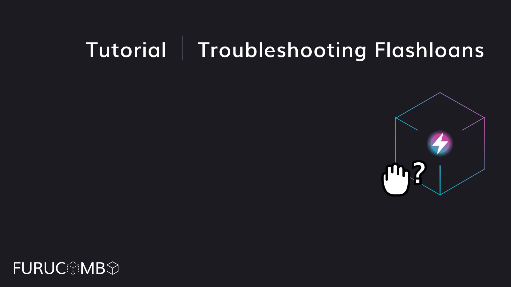

# Troubleshooting Flash Loans

To learn more about flash loans, and how to appropriately set up a flash loan combo, visit our [tutorial](https://docs.furucombo.app/using-furucombo-1/tutorials/flashloan-combo) first before proceeding

This guide is for troubleshooting flash loan errors, such as:

* _Fails at 0th cube_
* _Something is wrong inside flash loan cubes_
* _Completing transactions but nothing happens_
* _And any other problems related to flash loans not processing_

## **Common problems:**

1. Not enough liquidity on the DEX
2. Not allowing for price slippage between token swaps
3. Performing the same swap over and over
4. I complete the transaction, but nothing happens
5. Other problems

## **Solving Problems:**

1. **Not enough liquidity in DEX**
   1. Balancer V1, and specific tokens like USDK can cause problems with low liquidity
   2. Use another DEX that has higher liquidity, or use a different token to swap 
2. **Not allowing for price slippage between token swaps**
   1. The first option is to use the ‘previous amount’ function provided by Furucombo when swapping from one cube to another. The ‘previous amount’ function will use the actual amount from a previous cube to the next cube when processing on-chain to prevent the price slippage issue
      1. However, the following cubes do not support the ‘previous amount’ function, therefore there is no slippage buffer when swapping which causes the combo to fail easily. Therefore do no use the ‘previous amount’ function on:
         1. 1inch
         2. Balancer
      2. When using 1inch or Balancer, lower the amount between swaps to allow for price slippage \(~0.3%\). For example, lower the ETH from 1 to 0.99 to allow for price slippage between swaps. You may have to do this for every swap you do when using the 1inch or Balancer cubes.
   2. Examples:
      1. Combo \(without using previous amount\):
         1. Uniswap: swap 1DAI to 1USDC
         2. Uniswap: swap 1USDC to USDT
         3. Result: If the swapping result of the 1st cube is lower than 1USDC, the combo will fail at the 2nd cube
      2. Combo 2 \(using previous amount\)
         1. Uniswap: Swap 1DAI to 1USDC
         2. Uniswap: Swap ‘previous amount’ to USDT
         3. Result: If the swapping result of the 1st cube is lower than 1 USDC, the proxy contract will still use the result to process the 2nd cube, resulting in a successful transaction
      3. Combo 3 \(using previous amount 1inch/balancer\)
         1. Uniswap: Swap 1DAI to 1USDC
         2. 1Inch: Swap ‘previous amount’ to USDT
         3. Result: If the swapping result of the 1st cube is lower than 1usdc, the proxy contract still asks for 1 USDC to execute the 1inch swap, resulting in the combo to fail at the 2nd cube 
3. **Performing the same swap over and over**
   1. Performing the same swap over and over to create an arbitrage opportunity will not work \(unless the price action is low enough that there is minimal slippage\)
   2. If the oracle shows that each swap will be in a profit, it is suggesting the first swap is in a profit. It does not take into account all subsequent swaps because this has not yet adjusted the price on-chain
   3. As a swap is performed on-chain, the price adjusts based on the amount of slippage or price action 
4. **I complete the transaction, but nothing happens**
   1. When using Furucombo \(Or any other DeFi product\), if you haven’t given unlimited approval to a token in the settings menu, you have to approve a token before allowing the contract to use those funds.
      1. This is NOT required when using a flash loan, because you’re paying back the entirety of the flash loan before the end of the transaction
      2. When a flash loan is not profitable, it will instead ask for an ‘approve’ instead of a ‘send’ transaction. This can result in an infinite loop ‘approve’ as the price keeps adjusting, and in some cases when the token required to ‘send’ the transaction increases then the ‘approve’ button will appear again.
      3. If ‘appove’ appears, double check the top left under initial funds required and make sure that that portion is zero. If it is not, then that means the flash loan will not be profitable. 
5. **Other Problems**
   1. Typically flash loans are also paid back in the denomination they are borrowed in. For example, if you borrow DAI, ensure that your flash loan is also paying back in DAI
   2. If using the ‘repay’ or ‘borrow’ functions inside of a flash loan, ensure that an ‘add funds’ or ‘return funds’ cubes are inserted in the flash loan to update the smart contract on the new collateral. You can read more about how these cubes work [here](https://docs.furucombo.app/using-furucombo-1/combo-page#utility-cubes) \(or also in the top left you can monitor how these cubes affect the transaction\). Also keep in mind [Aave’s risk parameters](https://docs.aave.com/risk/asset-risk/risk-parameters) if you are using these functions.

If you are still having issues, please join us on our [Discord](https://discord.furucombo.app/) in the \#support channel and we will be glad to help you diagnose what the problem might be.

